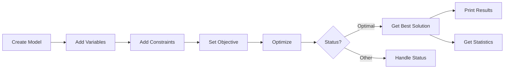

# Basic Modeling

This guide covers the core SCIP.NET modeling API — variables, linear expressions, constraints, solving, and solution retrieval.

---

## The Model Class

`Model` is the central class representing an optimization problem. It implements `IDisposable` for deterministic resource cleanup.

```csharp
using ScipNet;
using ScipNet.Core;

// Create a model (default name is "model")
using var model = new Model("my_problem");
```

The constructor accepts two optional parameters:

```csharp
public Model(string name = "model", bool includeDefaultPlugins = true)
```

- `name` — A descriptive name for the problem
- `includeDefaultPlugins` — Whether to load all SCIP default plugins (should be `true` for most cases)

### Model Properties

| Property | Type | Description |
|----------|------|-------------|
| `Name` | `string` | Model name |
| `ObjectiveSense` | `ObjectiveSense` | Current objective direction |
| `Variables` | `IReadOnlyCollection<Variable>` | All variables in the model |
| `Constraints` | `IReadOnlyCollection<Constraint>` | All constraints in the model |
| `SolutionCount` | `int` | Number of solutions in the solution pool |

---

## Variables

Variables are created via `Model.AddVariable()`:

```csharp
Variable AddVariable(string name, double lowerBound, double upperBound, VariableType type)
```

### Variable Types

| Enum Value | Domain | Description |
|------------|--------|-------------|
| `VariableType.Binary` | $x \in \{0, 1\}$ | Binary (0-1) variable |
| `VariableType.Integer` | $x \in \{\ell, \dots, u\}$ | General integer variable |
| `VariableType.Continuous` | $\ell \leq x \leq u$ | Continuous (real) variable |

### Variable Properties

| Property | Type | Description |
|----------|------|-------------|
| `Name` | `string` | Variable name |
| `Type` | `VariableType` | Variable type |
| `LowerBound` | `double` | Lower bound |
| `UpperBound` | `double` | Upper bound |

### Examples

```csharp
// Binary variable
var z = model.AddVariable("z", 0, 1, VariableType.Binary);

// Integer variable in [0, 100]
var n = model.AddVariable("n", 0, 100, VariableType.Integer);

// Continuous variable with no bounds
var x = model.AddVariable("x", 
    double.NegativeInfinity, 
    double.PositiveInfinity, 
    VariableType.Continuous);
```

---

## Linear Expressions

SCIP.NET uses operator overloading to build linear expressions naturally.

### Operators

| Operator | Description | Example |
|----------|-------------|---------|
| `+` | Addition | `x + y`, `x + 2`, `x + expr` |
| `-` | Subtraction | `x - y`, `x - 1`, `x - expr` |
| `*` | Scalar multiplication | `3 * x`, `x * 2`, `0.5 * expr` |
| Implicit `double` | Constant term | Works with any arithmetic expression |

### Expression Building

```csharp
var expr1 = x + 2 * y;              // x + 2y
var expr2 = 3 * x - y + 5;          // 3x - y + 5
var expr3 = expr1 + expr2;          // (x + 2y) + (3x - y + 5) = 4x + y + 5

// Using LinearExpression directly
var sum = new LinearExpression();
for (int i = 0; i < 10; i++)
    sum = sum + x[i];               // x[0] + x[1] + ... + x[9]
```

### Expression Methods

| Method | Description |
|--------|-------------|
| `AddTerm(Variable, double)` | Add a term with coefficient |
| `AddConstant(double)` | Add a constant value |
| `Evaluate(Solution)` | Evaluate expression value for a given solution |

---

## Constraints

### Linear Constraints

Created from `LinearExpression` using constraint builder methods:

```csharp
// Less than or equal:  x + 2y <= 10
model.AddConstraint((x + 2 * y).Leq(10));

// Greater than or equal:  2x + y >= 5
model.AddConstraint((2 * x + y).Geq(5));

// Equal:  x - y == 1
model.AddConstraint((x - y).Eq(1));
```

### Range Constraints

A two-sided bound: $\ell \leq \text{expr} \leq u$

```csharp
// 3 <= x + 2y <= 10
model.AddConstraint((x + 2 * y).Between(3, 10));
```

### Constraint Types

| Type | Description |
|------|-------------|
| `LinearConstraint` | $a^\top x \leq b$, $a^\top x \geq b$, $a^\top x = b$ |
| `RangeConstraint` | $\ell \leq a^\top x \leq u$ |
| `NonlinearConstraint` | $f(x) \leq b$ (see [Nonlinear Modeling](nonlinear-modeling.md)) |
| `IndicatorConstraint` | $z = 1 \implies a^\top x \leq b$ (see [Indicator Constraints](indicator-constraints.md)) |

---

## Objective Function

### Linear Objective

```csharp
// Maximize: x + 2y
model.SetObjective(x + 2 * y, ObjectiveSense.Maximize);

// Minimize: 3x - y
model.SetObjective(3 * x - y, ObjectiveSense.Minimize);
```

### Setting Objective Sense Only

```csharp
model.SetObjectiveSense(ObjectiveSense.Maximize);
```

### Evaluate Objective After Solving

For linear objectives set via `SetObjective(LinearExpression, ...)`:

```csharp
var solutions = model.GetSparseSolutionsWithVariables();
foreach (var sol in solutions)
{
    double objVal = model.EvaluateObjective(sol);
    Console.WriteLine($"Objective: {objVal}");
}
```

> **Note:** `EvaluateObjective` is primarily for enumerated solutions (via `Count()`). For standard `Optimize()` results, use `Solution.ObjectiveValue`.

---

## Solving

```csharp
SolveStatus status = model.Optimize();
```

### Solve Status Values

| Status | Meaning |
|--------|---------|
| `SolveStatus.Optimal` | Optimal solution found |
| `SolveStatus.Infeasible` | Problem has no feasible solution |
| `SolveStatus.Unbounded` | Objective is unbounded |
| `SolveStatus.InfeasibleOrUnbounded` | Either infeasible or unbounded |
| `SolveStatus.TimeLimit` | Stopped by time limit |
| `SolveStatus.NodeLimit` | Stopped by node limit |
| `SolveStatus.GapLimit` | Stopped by gap limit |
| `SolveStatus.MemoryLimit` | Stopped by memory limit |
| `SolveStatus.UserInterrupt` | User interrupted |
| `SolveStatus.SolutionLimit` | Stopped by solution limit |

### Optimal Solve Flow



---

## Solutions

### Best Solution

```csharp
Solution? solution = model.GetBestSolution();
if (solution != null)
{
    Console.WriteLine($"Objective: {solution.ObjectiveValue:F4}");
    Console.WriteLine($"x = {solution.GetValue(x):F4}");
    Console.WriteLine($"y = {solution.GetValue(y):F4}");
}
```

### All Solutions in Pool

```csharp
IReadOnlyList<Solution> allSolutions = model.GetSolutions();
foreach (var sol in allSolutions)
{
    Console.WriteLine($"Sol {i}: obj = {sol.ObjectiveValue:F4}");
}
```

### Solution Class

| Member | Description |
|--------|-------------|
| `ObjectiveValue` | Objective function value |
| `GetValue(Variable)` | Value of a specific variable in this solution |
| `IsFeasible()` | Whether the solution satisfies all constraints |

---

## Statistics

```csharp
var stats = model.GetStatistics();
Console.WriteLine($"Solving time:  {stats.SolvingTime:F2}s");
Console.WriteLine($"Total nodes:   {stats.TotalNodes}");
Console.WriteLine($"Open nodes:    {stats.OpenNodes}");
Console.WriteLine($"Primal bound:  {stats.PrimalBound:F4}");
Console.WriteLine($"Dual bound:    {stats.DualBound:F4}");
Console.WriteLine($"Gap:           {stats.Gap:P2}");
Console.WriteLine($"LP iterations: {stats.NLpIterations}");
Console.WriteLine($"Solutions:     {stats.NSolutionsFound}");
```

### Statistics Properties

| Property | Type | Description |
|----------|------|-------------|
| `SolvingTime` | `double` | Wall-clock solving time (seconds) |
| `TotalNodes` | `long` | Total branch-and-bound nodes processed |
| `OpenNodes` | `int` | Number of nodes remaining in the tree |
| `PrimalBound` | `double` | Best primal (feasible) bound |
| `DualBound` | `double` | Best dual (relaxation) bound |
| `Gap` | `double` | Optimality gap: $\frac{|\text{Primal} - \text{Dual}|}{\min(|\text{Primal}|, |\text{Dual}|)}$ |
| `NLpIterations` | `long` | Total LP iterations performed |
| `NSolutionsFound` | `int` | Number of feasible solutions found |

---

## Complete Example

```csharp
using System;
using ScipNet;
using ScipNet.Core;

// Maximize:  x + 2y
// Subject to: x + y  <= 5
//             2x + y >= 3
//             x - y  == 1
//             x, y ∈ [0, 10], integers

using var model = new Model("basic_example");

var x = model.AddVariable("x", 0, 10, VariableType.Integer);
var y = model.AddVariable("y", 0, 10, VariableType.Integer);

model.SetObjective(x + 2 * y, ObjectiveSense.Maximize);

model.AddConstraint((x + y).Leq(5));
model.AddConstraint((2 * x + y).Geq(3));
model.AddConstraint((x - y).Eq(1));

var status = model.Optimize();

if (status == SolveStatus.Optimal)
{
    var sol = model.GetBestSolution();
    Console.WriteLine($"Objective: {sol.ObjectiveValue}");
    Console.WriteLine($"x = {sol.GetValue(x)}, y = {sol.GetValue(y)}");
}

var stats = model.GetStatistics();
Console.WriteLine($"Solved in {stats.SolvingTime:F3}s, {stats.TotalNodes} nodes");
```
