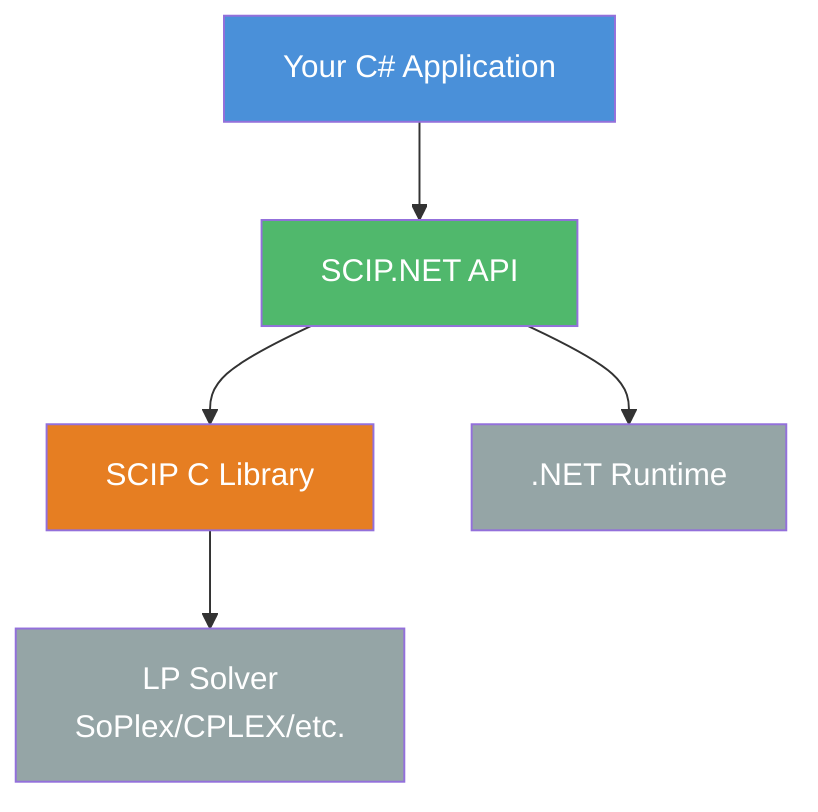

# SCIP.NET Documentation

> **SCIP.NET** — A modern C# wrapper for the [SCIP](https://scipopt.org/) (Solving Constraint Integer Programs) optimization solver.

---

## Overview

SCIP.NET provides a type-safe, idiomatic C# interface to the SCIP optimization solver. It leverages operator overloading for natural mathematical expression syntax, `SafeHandle` for RAII resource management, and P/Invoke for high-performance native calls.



## Features

- **Type Safety** — Strongly typed variables, constraints, and expressions leverage C#'s type system
- **Natural Syntax** — Operator overloading for mathematical expressions: `x + 2 * y`, `(x + y).Leq(5)`
- **Resource Management** — `SafeHandle`-based RAII via `IDisposable`
- **Cross-Platform** — .NET 8.0+, runs on Windows, Linux, and macOS
- **Error Handling** — Structured exception hierarchy mapping SCIP return codes to C# exceptions
- **High Performance** — Direct P/Invoke calls to the native SCIP library
- **Nonlinear Support** — Built-in expression tree for nonlinear functions: $\sin$, $\cos$, $\exp$, $\log$, $\sqrt{\cdot}$, $|\cdot|$, $x^n$
- **Solution Enumeration** — Count/enumerate all feasible solutions via SCIP's `countsols` constraint handler

## Project Structure

```
SCIP.NET/
├── src/
│   └── ScipNet/
│       ├── ScipNet.cs           # Entry point and version info
│       ├── Core/
│       │   ├── Enums.cs         # All enum types
│       │   ├── Model.cs         # Main optimization model
│       │   ├── Variable.cs      # Decision variables
│       │   ├── LinearExpression.cs   # Linear expression DSL
│       │   ├── NonlinearExpression.cs # Nonlinear expression tree
│       │   ├── Constraint.cs         # LinearConstraint, RangeConstraint
│       │   ├── NonlinearConstraint.cs # Nonlinear constraints
│       │   ├── IndicatorConstraint.cs # Indicator (implication) constraints
│       │   ├── Solution.cs      # Solution representation
│       │   └── Statistics.cs    # Solver statistics
│       └── Native/
│           ├── ScipHandle.cs       # SafeHandle wrapper
│           ├── ScipNativeMethods.cs # P/Invoke declarations
│           └── ErrorHandler.cs     # Exception hierarchy
├── examples/
│   ├── Example1_BasicModel.cs        # Basic LP/MIP modeling
│   ├── Example2_NonlinearModel.cs    # 10 nonlinear function examples
│   ├── Example3_SolutionPoolExample.cs # Solution enumeration
│   └── Example4_KnapsackSolutionPool.cs # Knapsack + solution pool
├── docs/
│   ├── index.md                     # This file
│   ├── getting-started.md           # Installation & quick start
│   ├── basic-modeling.md            # Variables, expressions, constraints
│   ├── nonlinear-modeling.md        # Nonlinear functions
│   ├── solution-pool.md             # Solution enumeration
│   ├── indicator-constraints.md     # Indicator constraints
│   └── parameter-reference.md       # Parameter configuration
└── README.md
```

## Quick Links

| Document | Description |
|----------|-------------|
| [Getting Started](getting-started.md) | Installation, build, dependencies, quick start |
| [Basic Modeling](basic-modeling.md) | Variables, linear expressions, constraints, solving, solutions |
| [Nonlinear Modeling](nonlinear-modeling.md) | $\sin$, $\cos$, $\exp$, $\log$, $\sqrt{\cdot}$, $|\cdot|$, $x^n$ |
| [Solution Pool](solution-pool.md) | Enumerating all feasible solutions |
| [Indicator Constraints](indicator-constraints.md) | Implication constraints (`if var = 1 then ...`) |
| [Parameter Reference](parameter-reference.md) | SCIP parameter tuning, emphasis modes |

## Mathematical Formulation

SCIP.NET models a standard **Mixed Integer Program (MIP)**:

$$
\begin{aligned}
\min_{x} \quad & c^\top x + f(x) \\
\text{s.t.} \quad & A x \geq b \\
& \ell \leq x \leq u \\
& x_j \in \mathbb{Z} \; \forall j \in \mathcal{I} \\
& x_j \in \{0, 1\} \; \forall j \in \mathcal{B}
\end{aligned}
$$

Where:
- $c^\top x$ is the linear objective (or $f(x)$ for nonlinear objectives)
- $A x \geq b$ are linear constraints
- $\ell \leq x \leq u$ are variable bounds
- $\mathcal{I}$ is the set of integer variables
- $\mathcal{B}$ is the set of binary variables

## Dependencies

- **.NET 8.0+** — Runtime environment
- **SCIP C library 9.0+** — Native optimization solver (requires separate installation)

## References

- [SCIP Official Documentation](https://scipopt.org/doc/html/)
- [SCIPpp (C++)](https://github.com/scipopt/scippp)
- [PySCIPOpt (Python)](https://github.com/scipopt/PySCIPOpt)

## License

Apache License 2.0
