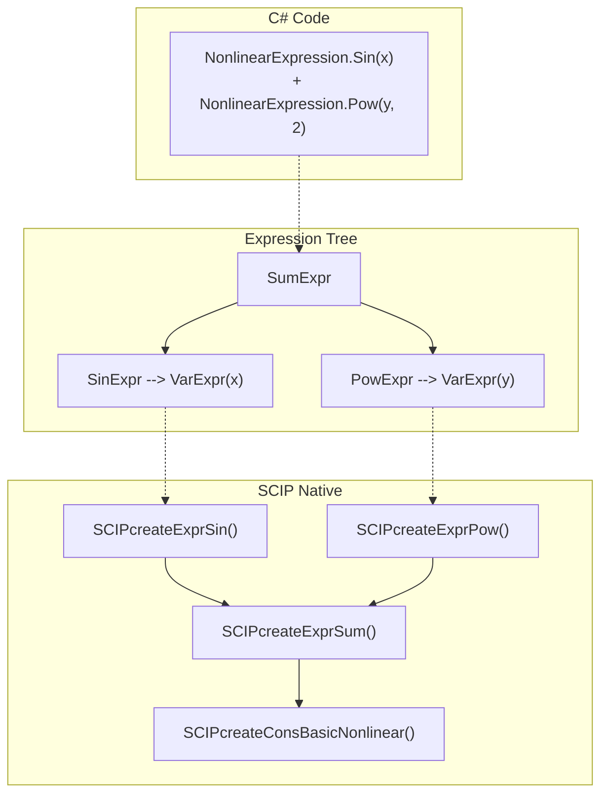
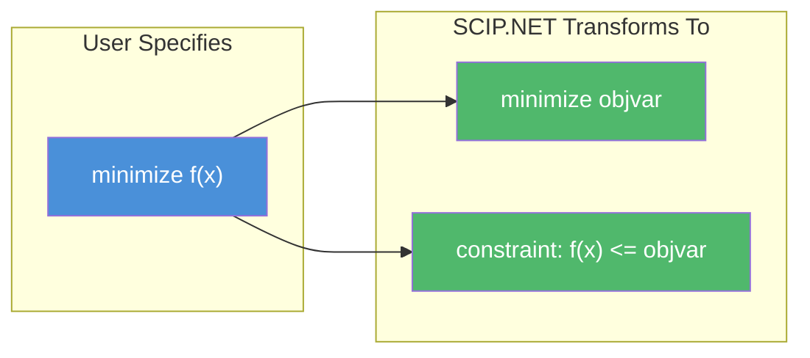

# Nonlinear Modeling

SCIP.NET provides a rich set of nonlinear functions for modeling expressions like $\sin(x)$, $\cos(x)$, $e^x$, $\ln(x)$, $\sqrt{x}$, $|x|$, and $x^n$.

---

## Overview

The `NonlinearExpression` class builds an expression tree internally, which SCIP uses to construct the native constraint via the epigraph reformulation.



---

## Supported Functions

| Method | Mathematical Form | Description |
|--------|-------------------|-------------|
| `Sin(x)` | $\sin(x)$ | Sine (radians) |
| `Cos(x)` | $\cos(x)$ | Cosine (radians) |
| `Exp(x)` | $e^x$ | Exponential |
| `Log(x)` | $\ln(x)$ | Natural logarithm |
| `Sqrt(x)` | $\sqrt{x}$ | Square root |
| `Abs(x)` | $|x|$ | Absolute value |
| `Pow(x, n)` | $x^n$ | Power function |

## Creating Nonlinear Expressions

### Implicit Conversions

`NonlinearExpression` accepts implicit conversions from:

- `Variable` — directly use variables in nonlinear expressions
- `double` — use numeric constants
- `LinearExpression` — mix linear and nonlinear parts

```csharp
// These are all valid NonlinearExpressions:
NonlinearExpression a = x;              // Variable → NonlinearExpression
NonlinearExpression b = 3.14;           // double   → NonlinearExpression
NonlinearExpression c = x + 2 * y;      // LinearExpression → NonlinearExpression
```

### Arithmetic Operators

| Operator | Example | Result |
|----------|---------|--------|
| `+` | `Sin(x) + Cos(y)` | $\sin(x) + \cos(y)$ |
| `-` | `Exp(x) - Log(y)` | $e^x - \ln(y)$ |
| `*` | `x * y` | $x \cdot y$ |
| `/` | `x / y` | $x / y$ (implemented as $x \cdot y^{-1}$) |
| Unary `-` | `-Pow(x, 2)` | $-x^2$ |

### Creating Constraints

```csharp
// expr <= rhs
NonlinearConstraint leq = expr.Leq(5.0);

// expr >= rhs
NonlinearConstraint geq = expr.Geq(3.0);

// expr == rhs
NonlinearConstraint eq = expr.Eq(1.0);

// lhs <= expr <= rhs
NonlinearConstraint between = expr.Between(0.5, 2.0);
```

---

## Examples

### 1. Division Constraint

$$
\begin{aligned}
\max \quad & x_1 + x_2 \\
\text{s.t.} \quad & 0.5 \leq \frac{x_1}{x_2} \leq 2.0 \\
& 1.0 \leq x_1, x_2 \leq 10.0
\end{aligned}
$$

```csharp
using var model = new Model("division");

var x1 = model.AddVariable("x1", 1.0, 10.0, VariableType.Continuous);
var x2 = model.AddVariable("x2", 1.0, 10.0, VariableType.Continuous);

model.SetObjective(x1 + x2, ObjectiveSense.Maximize);

// Division constraint: 0.5 <= x1/x2 <= 2.0
var ratio = (NonlinearExpression)x1 / x2;
model.AddConstraint(ratio.Between(0.5, 2.0));

model.Optimize();
```

### 2. Power Function — $x^2 + y^2$

$$
\begin{aligned}
\min \quad & x^2 + y^2 \\
\text{s.t.} \quad & x + y \geq 3.0 \\
& 0 \leq x, y \leq 10
\end{aligned}
$$

```csharp
using var model = new Model("power");

var x = model.AddVariable("x", 0.0, 10.0, VariableType.Continuous);
var y = model.AddVariable("y", 0.0, 10.0, VariableType.Continuous);

model.AddConstraint((x + y).Geq(3.0));

NonlinearExpression objExpr = NonlinearExpression.Pow(x, 2.0) 
                             + NonlinearExpression.Pow(y, 2.0);
model.SetObjective(objExpr, ObjectiveSense.Minimize);

model.Optimize();
```

### 3. Exponential Function — $e^x + e^y$

$$
\begin{aligned}
\min \quad & e^x + e^y \\
\text{s.t.} \quad & x + y \geq 2.0 \\
& 0 \leq x, y \leq 5
\end{aligned}
$$

```csharp
using var model = new Model("exp_func");

var x = model.AddVariable("x", 0.0, 5.0, VariableType.Continuous);
var y = model.AddVariable("y", 0.0, 5.0, VariableType.Continuous);

model.AddConstraint((x + y).Geq(2.0));

var objExpr = NonlinearExpression.Exp(x) + NonlinearExpression.Exp(y);
model.SetObjective(objExpr, ObjectiveSense.Minimize);

model.Optimize();
```

### 4. Logarithm — $\ln(x) + \ln(y)$

$$
\begin{aligned}
\max \quad & \ln(x) + \ln(y) \\
\text{s.t.} \quad & x + y \leq 20.0 \\
& 1.0 \leq x, y \leq 10.0
\end{aligned}
$$

```csharp
using var model = new Model("log_func");

var x = model.AddVariable("x", 1.0, 10.0, VariableType.Continuous);
var y = model.AddVariable("y", 1.0, 10.0, VariableType.Continuous);

model.AddConstraint((x + y).Leq(20.0));

var objExpr = NonlinearExpression.Log(x) + NonlinearExpression.Log(y);
model.SetObjective(objExpr, ObjectiveSense.Maximize);

model.Optimize();
```

### 5. Absolute Value — $|x| + |y|$

$$
\begin{aligned}
\min \quad & |x| + |y| \\
\text{s.t.} \quad & x + y \geq 5.0 \\
& -10 \leq x, y \leq 10
\end{aligned}
$$

```csharp
using var model = new Model("abs_val");

var x = model.AddVariable("x", -10.0, 10.0, VariableType.Continuous);
var y = model.AddVariable("y", -10.0, 10.0, VariableType.Continuous);

model.AddConstraint((x + y).Geq(5.0));

var objExpr = NonlinearExpression.Abs(x) + NonlinearExpression.Abs(y);
model.SetObjective(objExpr, ObjectiveSense.Minimize);

model.Optimize();
```

### 6. Square Root — $\sqrt{x} + \sqrt{y}$

$$
\begin{aligned}
\min \quad & \sqrt{x} + \sqrt{y} \\
\text{s.t.} \quad & x + y \geq 10.0 \\
& 0 \leq x, y \leq 20
\end{aligned}
$$

```csharp
using var model = new Model("sqrt");

var x = model.AddVariable("x", 0.0, 20.0, VariableType.Continuous);
var y = model.AddVariable("y", 0.0, 20.0, VariableType.Continuous);

model.AddConstraint((x + y).Geq(10.0));

var objExpr = NonlinearExpression.Sqrt(x) + NonlinearExpression.Sqrt(y);
model.SetObjective(objExpr, ObjectiveSense.Minimize);

model.Optimize();
```

### 7. Trigonometric — $\sin(x) + \cos(y)$

$$
\begin{aligned}
\min \quad & \sin(x) + \cos(y) \\
\text{s.t.} \quad & 0 \leq x, y \leq 2\pi
\end{aligned}
$$

```csharp
using var model = new Model("trig");

double twoPI = 2.0 * Math.PI;
var x = model.AddVariable("x", 0.0, twoPI, VariableType.Continuous);
var y = model.AddVariable("y", 0.0, twoPI, VariableType.Continuous);

NonlinearExpression objExpr = NonlinearExpression.Sin(x) 
                            + NonlinearExpression.Cos(y);
model.SetObjective(objExpr, ObjectiveSense.Minimize);

model.Optimize();
```

### 8. Trigonometric Constraint — $\sin(x) \geq 0.5$

$$
\begin{aligned}
\max \quad & x \\
\text{s.t.} \quad & \sin(x) \geq 0.5 \\
& 0 \leq x \leq 2\pi
\end{aligned}
$$

```csharp
using var model = new Model("trig_cons");

double twoPI = 2.0 * Math.PI;
var x = model.AddVariable("x", 0.0, twoPI, VariableType.Continuous);

var sinX = NonlinearExpression.Sin(x);
model.AddConstraint(sinX.Geq(0.5));

model.SetObjective(x, ObjectiveSense.Maximize);

model.Optimize();
```

### 9. Composite — $\sin^2(x) + \cos^2(x)$

Trigonometric identity: $\sin^2(x) + \cos^2(x) = 1$

```csharp
using var model = new Model("trig_id");

var x = model.AddVariable("x", 0.0, Math.PI, VariableType.Continuous);

var sinSq = NonlinearExpression.Pow(NonlinearExpression.Sin(x), 2.0);
var cosSq = NonlinearExpression.Pow(NonlinearExpression.Cos(x), 2.0);
var objExpr = sinSq + cosSq;

model.SetObjective(objExpr, ObjectiveSense.Minimize);
model.Optimize();
// Output: objective ≈ 1.0 (the trigonometric identity)
```

### 10. Combined — $x^2 + e^y + |z|$

$$
\begin{aligned}
\min \quad & x^2 + e^y + |z| \\
\text{s.t.} \quad & x + y + z \geq 5.0 \\
& -5 \leq x, z \leq 5, \; 0 \leq y \leq 5
\end{aligned}
$$

```csharp
using var model = new Model("combined");

var x = model.AddVariable("x", -5.0, 5.0, VariableType.Continuous);
var y = model.AddVariable("y", 0.0, 5.0, VariableType.Continuous);
var z = model.AddVariable("z", -5.0, 5.0, VariableType.Continuous);

model.AddConstraint((x + y + z).Geq(5.0));

var objExpr = NonlinearExpression.Pow(x, 2.0) 
            + NonlinearExpression.Exp(y) 
            + NonlinearExpression.Abs(z);
model.SetObjective(objExpr, ObjectiveSense.Minimize);

model.Optimize();
```

---

## How Epigraph Reformulation Works

When `SetObjective(NonlinearExpression, ...)` is called, SCIP.NET automatically performs an **epigraph reformulation**:



For minimization:
- Original: $\min f(x)$
- Reformulated: $\min \text{objvar}$, subject to $f(x) \leq \text{objvar}$

For maximization:
- Original: $\max f(x)$
- Reformulated: $\max \text{objvar}$, subject to $f(x) \geq \text{objvar}$

The auxiliary variable `__objvar__` and constraint `__objcons__` are automatically managed by the `Model` class.

### Evaluating Nonlinear Objectives After Count()

After enumerating solutions via `Count()`, use `Model.EvaluateObjective()` to compute the objective value:

```csharp
model.SetObjective(nonlinearExpr, ObjectiveSense.Minimize);
model.Count();
var solutions = model.GetSparseSolutionsWithVariables();

foreach (var sol in solutions)
{
    double objVal = model.EvaluateObjective(sol);
    Console.WriteLine($"Objective: {objVal:F4}");
}
```

`EvaluateObjective()` automatically detects the `__objvar__` variable for nonlinear objectives.
