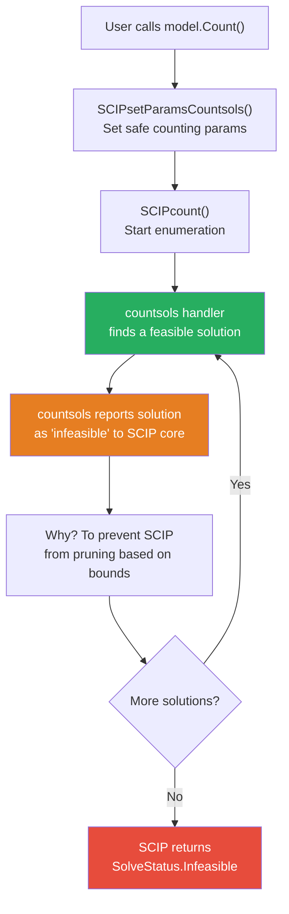

# Solution Pool — Enumerating All Feasible Solutions

SCIP.NET provides two complementary approaches to handle solutions:

| Method | Purpose | Return Status |
|--------|---------|---------------|
| `Optimize()` | Find one (or a few) **optimal** solutions | `Optimal` |
| `Count()` | **Enumerate all** feasible solutions | `Infeasible` (expected) |

---

## The Count() Method

`Count()` leverages SCIP's `countsols` constraint handler to iterate through **all** feasible solutions of a MIP. It is designed for exhaustive enumeration rather than optimality.

### Why Does Count() Return Infeasible?



**This is expected behavior, not an error!** The `countsols` constraint handler deliberately reports each found solution as "infeasible" to prevent SCIP from using bounds-based pruning. All collected solutions are **truly feasible** — they satisfy every constraint.

### Comparison: Optimize() vs Count()

| Aspect | `Optimize()` | `Count()` |
|--------|-------------|-----------|
| Purpose | Find optimal solution(s) | Enumerate all feasible solutions |
| Return Status | `Optimal` | `Infeasible` (expected) |
| Solutions Found | 1 or a few (optimal pool) | All feasible solutions |
| Storage | Default solution pool | `countsols` constraint handler |
| Retrieval | `GetBestSolution()` / `GetSolutions()` | `GetSparseSolutionsWithVariables()` |
| When to Use | Need optimal solution | Need all feasible solutions |

---

## Prerequisites for Count()

Before calling `Count()`, configure the model with these required parameters:

```csharp
// REQUIRED: Enable counting mode
model.SetEmphasis(ParamEmphasis.Counter, quiet: true);

// REQUIRED: Collect solutions (not just count them)
model.SetBoolParam("constraints/countsols/collect", true);

// RECOMMENDED: Set a solution limit to avoid unbounded enumeration
model.SetLongParam("constraints/countsols/sollimit", 100000);
```

### Optional Parameters

```csharp
// Time limit (seconds)
model.SetRealParam("limits/time", 60);

// Disable presolving to preserve original variable names
model.SetIntParam("presolving/maxrounds", 0);

// Suppress solver output
model.SetIntParam("display/verblevel", 0);
```

---

## Retrieving Solutions

### Step 1: Count

```csharp
var status = model.Count();
// status == SolveStatus.Infeasible (this is expected!)
```

### Step 2: Get Total Count

```csharp
long totalCount = model.GetCountedSolutionsCount();
Console.WriteLine($"Found {totalCount} feasible solutions");
```

### Step 3: Retrieve Solutions

`GetSparseSolutionsWithVariables()` unrolls SCIP's sparse solution representation into a list of concrete solution dictionaries:

```csharp
var solutions = model.GetSparseSolutionsWithVariables();

// Each solution is a Dictionary<Variable, double>
foreach (var sol in solutions)
{
    foreach (var kvp in sol)
    {
        Console.WriteLine($"{kvp.Key.Name} = {kvp.Value}");
    }
}
```

### Step 4: Evaluate Objective

```csharp
double objVal = model.EvaluateObjective(sol);
Console.WriteLine($"Objective: {objVal:F4}");
```

---

## Example 1: Combinatorial Enumeration ($C(N, K)$)

Enumerate all ways to select $K$ items from $N$ items.

$$
\text{Choose } K \text{ of } N: \quad \sum_{i=1}^{N} x_i = K, \; x_i \in \{0, 1\}
$$

Theoretical count: $\displaystyle \binom{N}{K} = \frac{N!}{K!(N-K)!}$

```csharp
using ScipNet;
using ScipNet.Core;

int N = 10, K = 5;

using var model = new Model("combination");

// Create binary variables
var x = new Variable[N];
for (int i = 0; i < N; i++)
    x[i] = model.AddVariable($"x{i}", 0, 1, VariableType.Binary);

// Constraint: exactly K items selected
var sum = new LinearExpression();
for (int i = 0; i < N; i++)
    sum = sum + x[i];
model.AddConstraint(sum.Eq(K));

// Configure counting
model.SetEmphasis(ParamEmphasis.Counter, quiet: true);
model.SetBoolParam("constraints/countsols/collect", true);
model.SetLongParam("constraints/countsols/sollimit", 100000);
model.SetIntParam("presolving/maxrounds", 0);
model.SetIntParam("display/verblevel", 0);

// Enumerate
model.Count();
long total = model.GetCountedSolutionsCount();
Console.WriteLine($"Found {total} solutions");
Console.WriteLine($"Theoretical: C({N},{K}) = {Combination(N, K)}");

// Retrieve and display
var solutions = model.GetSparseSolutionsWithVariables();
Console.WriteLine($"\nAll {solutions.Count} solutions:");
foreach (var sol in solutions)
{
    var selected = sol.Where(kvp => kvp.Value > 0.5)
                      .Select(kvp => kvp.Key.Name);
    Console.WriteLine($"  [{string.Join(", ", selected)}]");
}
```

---

## Example 2: Knapsack Enumeration

Enumerate all feasible ways to pack a knapsack with capacity $W$.

$$
\begin{aligned}
\max \quad & \sum_{i} p_i x_i \\
\text{s.t.} \quad & \sum_{i} w_i x_i \leq W \\
& x_i \in \{0, 1\}
\end{aligned}
$$

```csharp
using ScipNet;
using ScipNet.Core;

// Items: (name, weight, price)
var items = new[] {
    ("Chestnut",   4.0, 4500),
    ("Apple",      5.0, 5700),
    ("Orange",     2.0, 2250),
    ("Strawberry", 1.0, 1100),
    ("Melon",      6.0, 6700),
};
double maxWeight = 8.0;

using var model = new Model("knapsack");

var x = new Variable[items.Length];
for (int i = 0; i < items.Length; i++)
    x[i] = model.AddVariable($"x_{items[i].Name}", 0, 1, VariableType.Binary);

// Weight constraint
var weightExpr = new LinearExpression();
for (int i = 0; i < items.Length; i++)
    weightExpr = weightExpr + items[i].Weight * x[i];
model.AddConstraint(weightExpr.Leq(maxWeight));

// Objective (linear)
var priceExpr = new LinearExpression();
for (int i = 0; i < items.Length; i++)
    priceExpr = priceExpr + items[i].Price * x[i];
model.SetObjective(priceExpr, ObjectiveSense.Maximize);

// Configure counting
model.SetEmphasis(ParamEmphasis.Counter, quiet: true);
model.SetBoolParam("constraints/countsols/collect", true);
model.SetLongParam("constraints/countsols/sollimit", 100000);

model.Count();

var solutions = model.GetSparseSolutionsWithVariables();
Console.WriteLine($"Found {solutions.Count} feasible solutions");

// Find best solution
double bestObj = double.MinValue;
int bestIdx = -1;

for (int i = 0; i < solutions.Count; i++)
{
    double obj = model.EvaluateObjective(solutions[i]);
    if (obj > bestObj) { bestObj = obj; bestIdx = i; }
}

Console.WriteLine($"Best solution: objective = ${bestObj:F2}");
```

---

## API Reference

### Model Methods for Counting

```csharp
// Enumerate all feasible solutions
SolveStatus Count();

// Get total number of enumerated solutions
long GetCountedSolutionsCount();

// Get raw sparse solution data from SCIP
(IntPtr vars, int nvars, IntPtr sols, int nsols) GetCountedSparseSolutions();

// Check if sparse solutions are available
bool AreSparseSolutionsAvailable();

// Unroll sparse solutions into variable-value dictionaries
List<Dictionary<Variable, double>> GetSparseSolutionsWithVariables();

// Evaluate objective for a solution dictionary
double EvaluateObjective(Dictionary<Variable, double> solution);
```

### Parameter Configuration

```csharp
// Enable counting emphasis
model.SetEmphasis(ParamEmphasis.Counter, quiet: true);

// Required: collect solutions
model.SetBoolParam("constraints/countsols/collect", true);

// Solution limit
model.SetLongParam("constraints/countsols/sollimit", 100000);

// Time limit (seconds)
model.SetRealParam("limits/time", 60);
```

---

## Common Pitfalls

| Symptom | Likely Cause | Fix |
|---------|-------------|-----|
| `Count()` returns `Infeasible`, `GetCountedSolutionsCount()` returns 0 | Missing `constraints/countsols/collect = true` | Add `SetBoolParam("constraints/countsols/collect", true)` |
| Only 1 solution found | Using `Optimize()` instead of `Count()` | Use `Count()` |
| Variable names don't match | Presolving transformed variables | Set `presolving/maxrounds = 0` |
| Solution count seems low | Solution limit reached | Increase `sollimit` |
| `Count()` and `Optimize()` can't both work on one model | Different internal state | Use separate `Model` instances |

```csharp
// WRONG: Cannot use Count() and Optimize() on the same model
model.Count();
model.Optimize(); // May fail or produce wrong results

// CORRECT: Use separate models
using var counter = new Model("counter");
// ... configure ...
counter.Count();

using var optimizer = new Model("optimizer");
// ... configure same problem ...
optimizer.Optimize();
```
