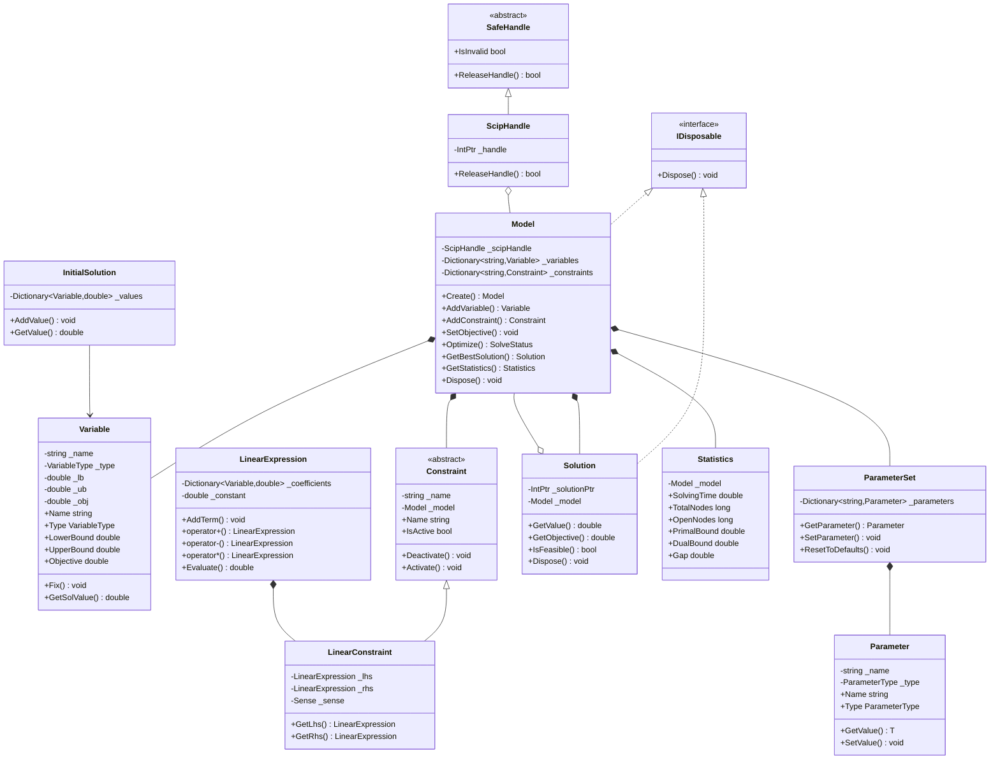

# SCIP.NET C# 接口架构设计文档

## 1. 概述

本文档详细描述了 SCIP.NET C# 接口的整体架构设计。该设计基于对 SCIPpp (C++)、PySCIPOpt (Python) 和 SCIP 核心库 (C) 接口的深入分析，旨在提供一个现代、类型安全且易于使用的 C# 封装。

### 1.1 设计目标

- **类型安全**：充分利用 C# 的强类型系统，提供编译时类型检查
- **易用性**：提供自然、直观的 API，支持运算符重载和表达式语法
- **性能**：最小化托管/非托管边界跨越，高效管理原生资源
- **可扩展性**：支持插件系统，允许用户自定义约束处理器、分支规则等
- **兼容性**：与 SCIPpp 和 PySCIPOpt 保持概念上的一致性

### 1.2 技术栈

- **.NET 8.0+**：支持最新的 C# 语言特性
- **P/Invoke**：用于调用 SCIP C 接口
- **SafeHandle**：用于原生资源管理
- **Span<T>**：用于高效数组操作
- **Nullable Reference Types**：增强类型安全

---

## 2. 整体架构

### 2.1 命名空间组织

```
ScipNet
├── Core                    # 核心接口和基础类
│   ├── Model               # 主模型类
│   ├── Variable            # 变量类
│   ├── Constraint          # 约束基类和实现
│   ├── Solution            # 解类
│   ├── Expression          # 表达式系统
│   └── Statistics         # 统计信息
├── Native                 # 原生接口层
│   ├── Interop            # P/Invoke 声明
│   ├── SafeHandles        # SafeHandle 实现
│   └── ErrorHandling     # 错误处理
├── Plugins               # 插件系统
│   ├── ConstraintHandler  # 约束处理器
│   ├── BranchRule        # 分支规则
│   ├── Heuristic        # 启发式
│   ├── Separator        # 割平面分离器
│   ├── Propagator       # 传播器
│   └── Presolver        # 预处理器
├── Parameters            # 参数系统
│   ├── Parameter        # 参数类
│   └── ParameterSet     # 参数集合
└── Utilities            # 工具类
    ├── Logger           # 日志
    └── Extensions       # 扩展方法
```

### 2.2 架构分层


---

## 3. 核心类层次结构

### 3.1 类层次图



### 3.2 核心类详细设计

#### 3.2.1 Model 类

Model 类是 SCIP.NET 的核心类，代表一个优化问题模型。

```csharp
namespace ScipNet.Core;

/// <summary>
/// 代表 SCIP 优化问题模型
/// </summary>
public sealed class Model : IDisposable
{
    private readonly ScipHandle _scipHandle;
    private readonly Dictionary<string, Variable> _variables;
    private readonly Dictionary<string, Constraint> _constraints;
    private readonly ParameterSet _parameterSet;
    private bool _disposed;

    /// <summary>
    /// 获取模型名称
    /// </summary>
    public string Name { get; private set; }

    /// <summary>
    /// 获取目标函数方向
    /// </summary>
    public ObjectiveSense ObjectiveSense { get; private set; }

    /// <summary>
    /// 获取所有变量
    /// </summary>
    public IReadOnlyCollection<Variable> Variables => _variables.Values;

    /// <summary>
    /// 获取所有约束
    /// </summary>
    public IReadOnlyCollection<Constraint> Constraints => _constraints.Values;

    /// <summary>
    /// 获取参数集合
    /// </summary>
    public ParameterSet Parameters => _parameterSet;

    /// <summary>
    /// 创建一个新的 SCIP 模型
    /// </summary>
    /// <param name="name">模型名称</param>
    /// <param name="includeDefaultPlugins">是否包含默认插件</param>
    public Model(string name = "model", bool includeDefaultPlugins = true)
    {
        _scipHandle = ScipNativeMethods.Create(name);
        _variables = new Dictionary<string, Variable>();
        _constraints = new Dictionary<string, Constraint>();
        _parameterSet = new ParameterSet(_scipHandle);
        Name = name;
        ObjectiveSense = ObjectiveSense.Minimize;

        if (includeDefaultPlugins)
        {
            IncludeDefaultPlugins();
        }

        CreateProblem(name);
    }

    /// <summary>
    /// 添加变量到模型
    /// </summary>
    public Variable AddVariable(
        string name,
        double lowerBound,
        double upperBound,
        double objective,
        VariableType type)
    {
        var variable = new Variable(this, name, lowerBound, upperBound, objective, type);
        _variables[name] = variable;
        return variable;
    }

    /// <summary>
    /// 添加约束到模型
    /// </summary>
    public T AddConstraint<T>(T constraint) where T : Constraint
    {
        _constraints[constraint.Name] = constraint;
        return constraint;
    }

    /// <summary>
    /// 设置目标函数
    /// </summary>
    public void SetObjective(LinearExpression expression, ObjectiveSense sense)
    {
        ObjectiveSense = sense;
        // 实现细节...
    }

    /// <summary>
    /// 优化模型
    /// </summary>
    public SolveStatus Optimize()
    {
        // 实现细节...
        return SolveStatus.Unknown;
    }

    /// <summary>
    /// 获取最优解
    /// </summary>
    public Solution? GetBestSolution()
    {
        // 实现细节...
        return null;
    }

    /// <summary>
    /// 获取统计信息
    /// </summary>
    public Statistics GetStatistics()
    {
        return new Statistics(this);
    }

    /// <summary>
    /// 释放资源
    /// </summary>
    public void Dispose()
    {
        if (!_disposed)
        {
            _scipHandle?.Dispose();
            _disposed = true;
        }
    }

    private void IncludeDefaultPlugins()
    {
        ScipNativeMethods.IncludeDefaultPlugins(_scipHandle);
    }

    private void CreateProblem(string name)
    {
        ScipNativeMethods.CreateProb(_scipHandle, name);
    }
}
```

#### 3.2.2 Variable 类

```csharp
namespace ScipNet.Core;

/// <summary>
/// 代表优化问题中的决策变量
/// </summary>
public sealed class Variable
{
    private readonly Model _model;
    private readonly string _name;
    private readonly VariableType _type;
    private double _lb;
    private double _ub;
    private double _obj;

    /// <summary>
    /// 获取变量名称
    /// </summary>
    public string Name => _name;

    /// <summary>
    /// 获取变量类型
    /// </summary>
    public VariableType Type => _type;

    /// <summary>
    /// 获取或设置下界
    /// </summary>
    public double LowerBound
    {
        get => _lb;
        set
        {
            _lb = value;
            ScipNativeMethods.ChgVarLb(_model._scipHandle, this, value);
        }
    }

    /// <summary>
    /// 获取或设置上界
    /// </summary>
    public double UpperBound
    {
        get => _ub;
        set
        {
            _ub = value;
            ScipNativeMethods.ChgVarUb(_model._scipHandle, this, value);
        }
    }

    /// <summary>
    /// 获取或设置目标函数系数
    /// </summary>
    public double Objective
    {
        get => _obj;
        set
        {
            _obj = value;
            ScipNativeMethods.ChgVarObj(_model._scipHandle, this, value);
        }
    }

    internal Variable(
        Model model,
        string name,
        double lowerBound,
        double upperBound,
        double objective,
        VariableType type)
    {
        _model = model;
        _name = name;
        _lb = lowerBound;
        _ub = upperBound;
        _obj = objective;
        _type = type;

        ScipNativeMethods.CreateVar(
            _model._scipHandle,
            name,
            lowerBound,
            upperBound,
            objective,
            type,
            out _);
    }

    /// <summary>
    /// 将变量固定为指定值
    /// </summary>
    public void Fix(double value)
    {
        LowerBound = value;
        UpperBound = value;
    }

    /// <summary>
    /// 获取变量在指定解中的值
    /// </summary>
    public double GetSolValue(Solution solution)
    {
        return ScipNativeMethods.GetSolVal(_model._scipHandle, solution, this);
    }

    /// <summary>
    /// 创建线性表达式
    /// </summary>
    public static LinearExpression operator *(Variable variable, double coefficient)
    {
        return new LinearExpression().AddTerm(variable, coefficient);
    }

    public static LinearExpression operator *(double coefficient, Variable variable)
    {
        return variable * coefficient;
    }
}
```

#### 3.2.3 LinearExpression 类

```csharp
namespace ScipNet.Core;

/// <summary>
/// 代表线性表达式
/// </summary>
public sealed class LinearExpression
{
    private readonly Dictionary<Variable, double> _coefficients;
    private double _constant;

    /// <summary>
    /// 获取常数项
    /// </summary>
    public double Constant => _constant;

    /// <summary>
    /// 获取系数字典
    /// </summary>
    public IReadOnlyDictionary<Variable, double> Coefficients => _coefficients;

    public LinearExpression()
    {
        _coefficients = new Dictionary<Variable, double>();
        _constant = 0.0;
    }

    /// <summary>
    /// 添加项到表达式
    /// </summary>
    public LinearExpression AddTerm(Variable variable, double coefficient)
    {
        if (_coefficients.TryGetValue(variable, out double existing))
        {
            _coefficients[variable] = existing + coefficient;
        }
        else
        {
            _coefficients[variable] = coefficient;
        }
        return this;
    }

    /// <summary>
    /// 添加常数项
    /// </summary>
    public LinearExpression AddConstant(double value)
    {
        _constant += value;
        return this;
    }

    /// <summary>
    /// 加法运算符
    /// </summary>
    public static LinearExpression operator +(LinearExpression left, LinearExpression right)
    {
        var result = new LinearExpression();
        
        foreach (var kvp in left._coefficients)
        {
            result.AddTerm(kvp.Key, kvp.Value);
        }
        
        foreach (var kvp in right._coefficients)
        {
            result.AddTerm(kvp.Key, kvp.Value);
        }
        
        result._constant = left._constant + right._constant;
        return result;
    }

    public static LinearExpression operator +(LinearExpression expr, double value)
    {
        var result = new LinearExpression();
        foreach (var kvp in expr._coefficients)
        {
            result.AddTerm(kvp.Key, kvp.Value);
        }
        result._constant = expr._constant + value;
        return result;
    }

    public static LinearExpression operator +(double value, LinearExpression expr)
    {
        return expr + value;
    }

    /// <summary>
    /// 减法运算符
    /// </summary>
    public static LinearExpression operator -(LinearExpression left, LinearExpression right)
    {
        var result = new LinearExpression();
        
        foreach (var kvp in left._coefficients)
        {
            result.AddTerm(kvp.Key, kvp.Value);
        }
        
        foreach (var kvp in right._coefficients)
        {
            result.AddTerm(kvp.Key, -kvp.Value);
        }
        
        result._constant = left._constant - right._constant;
        return result;
    }

    /// <summary>
    /// 乘法运算符
    /// </summary>
    public static LinearExpression operator *(LinearExpression expr, double scalar)
    {
        var result = new LinearExpression();
        foreach (var kvp in expr._coefficients)
        {
            result.AddTerm(kvp.Key, kvp.Value * scalar);
        }
        result._constant = expr._constant * scalar;
        return result;
    }

    public static LinearExpression operator *(double scalar, LinearExpression expr)
    {
        return expr * scalar;
    }

    /// <summary>
    /// 计算表达式的值
    /// </summary>
    public double Evaluate(Solution solution)
    {
        double value = _constant;
        foreach (var kvp in _coefficients)
        {
            value += kvp.Value * kvp.Key.GetSolValue(solution);
        }
        return value;
    }

    /// <summary>
    /// 创建小于等于约束
    /// </summary>
    public LinearConstraint Leq(double rhs)
    {
        return new LinearConstraint(this, Sense.LessThanOrEqual, rhs);
    }

    /// <summary>
    /// 创建大于等于约束
    /// </summary>
    public LinearConstraint Geq(double rhs)
    {
        return new LinearConstraint(this, Sense.GreaterThanOrEqual, rhs);
    }

    /// <summary>
    /// 创建等于约束
    /// </summary>
    public LinearConstraint Eq(double rhs)
    {
        return new LinearConstraint(this, Sense.Equal, rhs);
    }
}
```

#### 3.2.4 LinearConstraint 类

```csharp
namespace ScipNet.Core;

/// <summary>
/// 约束方向
/// </summary>
public enum Sense
{
    LessThanOrEqual = -1,
    Equal = 0,
    GreaterThanOrEqual = 1
}

/// <summary>
/// 代表线性约束
/// </summary>
public sealed class LinearConstraint : Constraint
{
    private readonly LinearExpression _expression;
    private readonly Sense _sense;
    private readonly double _rhs;

    /// <summary>
    /// 获取表达式
    /// </summary>
    public LinearExpression Expression => _expression;

    /// <summary>
    /// 获取约束方向
    /// </summary>
    public Sense Sense => _sense;

    /// <summary>
    /// 获取右侧值
    /// </summary>
    public double RightHandSide => _rhs;

    public LinearConstraint(
        LinearExpression expression,
        Sense sense,
        double rhs,
        string? name = null)
        : base(name ?? $"cons_{Guid.NewGuid():N}")
    {
        _expression = expression;
        _sense = sense;
        _rhs = rhs;
    }

    /// <summary>
    /// 创建小于等于约束
    /// </summary>
    public static LinearConstraint operator <=(LinearExpression expr, double rhs)
    {
        return new LinearConstraint(expr, Sense.LessThanOrEqual, rhs);
    }

    /// <summary>
    /// 创建大于等于约束
    /// </summary>
    public static LinearConstraint operator >=(LinearExpression expr, double rhs)
    {
        return new LinearConstraint(expr, Sense.GreaterThanOrEqual, rhs);
    }

    /// <summary>
    /// 创建等于约束
    /// </summary>
    public static LinearConstraint operator ==(LinearExpression expr, double rhs)
    {
        return new LinearConstraint(expr, Sense.Equal, rhs);
    }
}
```

#### 3.2.5 Solution 类

```csharp
namespace ScipNet.Core;

/// <summary>
/// 代表 SCIP 解
/// </summary>
public sealed class Solution : IDisposable
{
    private readonly Model _model;
    private readonly IntPtr _solutionPtr;
    private bool _disposed;

    /// <summary>
    /// 获取目标函数值
    /// </summary>
    public double ObjectiveValue { get; private set; }

    internal Solution(Model model, IntPtr solutionPtr)
    {
        _model = model;
        _solutionPtr = solutionPtr;
        ObjectiveValue = ScipNativeMethods.GetSolOrigObj(_model._scipHandle, this);
    }

    /// <summary>
    /// 获取变量在解中的值
    /// </summary>
    public double GetValue(Variable variable)
    {
        return ScipNativeMethods.GetSolVal(_model._scipHandle, this, variable);
    }

    /// <summary>
    /// 检查解是否可行
    /// </summary>
    public bool IsFeasible()
    {
        return ScipNativeMethods.IsFeasible(_model._scipHandle, this);
    }

    public void Dispose()
    {
        if (!_disposed)
        {
            ScipNativeMethods.FreeSol(_model._scipHandle, this);
            _disposed = true;
        }
    }
}
```

#### 3.2.6 InitialSolution 类

```csharp
namespace ScipNet.Core;

/// <summary>
/// 代表初始解
/// </summary>
public sealed class InitialSolution
{
    private readonly Dictionary<Variable, double> _values;

    /// <summary>
    /// 获取变量值字典
    /// </summary>
    public IReadOnlyDictionary<Variable, double> Values => _values;

    public InitialSolution()
    {
        _values = new Dictionary<Variable, double>();
    }

    /// <summary>
    /// 设置变量值
    /// </summary>
    public InitialSolution SetValue(Variable variable, double value)
    {
        _values[variable] = value;
        return this;
    }

    /// <summary>
    /// 获取变量值
    /// </summary>
    public double GetValue(Variable variable)
    {
        return _values.TryGetValue(variable, out double value) ? value : 0.0;
    }

    /// <summary>
    /// 添加到模型
    /// </summary>
    public void AddToModel(Model model, string name = "initial_solution")
    {
        // 实现细节...
    }
}
```

#### 3.2.7 Statistics 类

```csharp
namespace ScipNet.Core;

/// <summary>
/// 代表求解统计信息
/// </summary>
public sealed class Statistics
{
    private readonly Model _model;

    /// <summary>
    /// 获取求解时间（秒）
    /// </summary>
    public double SolvingTime => ScipNativeMethods.GetSolvingTime(_model._scipHandle);

    /// <summary>
    /// 获取总节点数
    /// </summary>
    public long TotalNodes => ScipNativeMethods.GetNNodes(_model._scipHandle);

    /// <summary>
    /// 获取开放节点数
    /// </summary>
    public long OpenNodes => ScipNativeMethods.GetNOpenNodes(_model._scipHandle);

    /// <summary>
    /// 获取原始界
    /// </summary>
    public double PrimalBound => ScipNativeMethods.getPrimalbound(_model._scipHandle);

    /// <summary>
    /// 获取对偶界
    /// </summary>
    public double DualBound => ScipNativeMethods.getDualbound(_model._scipHandle);

    /// <summary>
    /// 获取间隙
    /// </summary>
    public double Gap => ScipNativeMethods.getGap(_model._scipHandle);

    /// <summary>
    /// 获取 LP 迭代次数
    /// </summary>
    public long NLpIterations => ScipNativeMethods.getNLPIterations(_model._scipHandle);

    /// <summary>
    /// 获取找到的解数量
    /// </summary>
    public int NSolutionsFound => ScipNativeMethods.getNSols(_model._scipHandle);

    internal Statistics(Model model)
    {
        _model = model;
    }

    /// <summary>
    /// 获取统计摘要
    /// </summary>
    public override string ToString()
    {
        return $"SolvingTime: {SolvingTime:F2}s, " +
               $"Nodes: {TotalNodes}, " +
               $"OpenNodes: {OpenNodes}, " +
               $"PrimalBound: {PrimalBound:F4}, " +
               $"DualBound: {DualBound:F4}, " +
               $"Gap: {Gap:P2}";
    }
}
```

#### 3.2.8 Parameter 和 ParameterSet 类

```csharp
namespace ScipNet.Parameters;

/// <summary>
/// 参数类型
/// </summary>
public enum ParameterType
{
    Bool,
    Int,
    LongInt,
    Real,
    Char,
    String
}

/// <summary>
/// 代表 SCIP 参数
/// </summary>
public sealed class Parameter
{
    private readonly ScipHandle _scipHandle;
    private readonly string _name;
    private readonly ParameterType _type;

    /// <summary>
    /// 获取参数名称
    /// </summary>
    public string Name => _name;

    /// <summary>
    /// 获取参数类型
    /// </summary>
    public ParameterType Type => _type;

    /// <summary>
    /// 获取参数描述
    /// </summary>
    public string Description => ScipNativeMethods.GetParamDesc(_scipHandle, _name);

    /// <summary>
    /// 获取默认值
    /// </summary>
    public object DefaultValue => ScipNativeMethods.GetParamDefault(_scipHandle, _name);

    internal Parameter(ScipHandle scipHandle, string name, ParameterType type)
    {
        _scipHandle = scipHandle;
        _name = name;
        _type = type;
    }

    /// <summary>
    /// 获取参数值
    /// </summary>
    public T GetValue<T>()
    {
        return ScipNativeMethods.GetParam<T>(_scipHandle, _name);
    }

    /// <summary>
    /// 设置参数值
    /// </summary>
    public void SetValue<T>(T value)
    {
        ScipNativeMethods.SetParam(_scipHandle, _name, value);
    }

    /// <summary>
    /// 重置为默认值
    /// </summary>
    public void ResetToDefault()
    {
        ScipNativeMethods.ResetParam(_scipHandle, _name);
    }
}

/// <summary>
/// 参数集合
/// </summary>
public sealed class ParameterSet
{
    private readonly ScipHandle _scipHandle;
    private readonly Dictionary<string, Parameter> _parameters;

    /// <summary>
    /// 获取所有参数
    /// </summary>
    public IReadOnlyCollection<Parameter> Parameters => _parameters.Values;

    internal ParameterSet(ScipHandle scipHandle)
    {
        _scipHandle = scipHandle;
        _parameters = new Dictionary<string, Parameter>();
        LoadParameters();
    }

    private void LoadParameters()
    {
        // 从 SCIP 加载所有参数
        int nParams = ScipNativeMethods.GetNParams(_scipHandle);
        for (int i = 0; i < nParams; i++)
        {
            string name = ScipNativeMethods.GetParamName(_scipHandle, i);
            ParameterType type = ScipNativeMethods.GetParamType(_scipHandle, name);
            _parameters[name] = new Parameter(_scipHandle, name, type);
        }
    }

    /// <summary>
    /// 获取参数
    /// </summary>
    public Parameter GetParameter(string name)
    {
        if (!_parameters.TryGetValue(name, out var parameter))
        {
            throw new ArgumentException($"Parameter '{name}' not found", nameof(name));
        }
        return parameter;
    }

    /// <summary>
    /// 设置参数值
    /// </summary>
    public void SetParameter<T>(string name, T value)
    {
        GetParameter(name).SetValue(value);
    }

    /// <summary>
    /// 重置所有参数为默认值
    /// </summary>
    public void ResetToDefaults()
    {
        ScipNativeMethods.ResetParams(_scipHandle);
    }

    /// <summary>
    /// 从文件读取参数
    /// </summary>
    public void ReadFromFile(string filename)
    {
        ScipNativeMethods.ReadParams(_scipHandle, filename);
    }

    /// <summary>
    /// 将参数写入文件
    /// </summary>
    public void WriteToFile(string filename)
    {
        ScipNativeMethods.WriteParams(_scipHandle, filename);
    }
}
```

---

## 4. 枚举类型设计

### 4.1 VariableType

```csharp
namespace ScipNet.Core;

/// <summary>
/// 变量类型，对应 SCIP_VARTYPE
/// </summary>
public enum VariableType
{
    /// <summary>
    /// 二元变量：x ∈ {0, 1}
    /// </summary>
    Binary = 0,

    /// <summary>
    /// 整数变量：x ∈ {lb, ..., ub}
    /// </summary>
    Integer = 1,

    /// <summary>
    /// 连续变量：lb ≤ x ≤ ub
    /// </summary>
    Continuous = 3
}
```

### 4.2 ObjectiveSense

```csharp
namespace ScipNet.Core;

/// <summary>
/// 目标函数方向，对应 SCIP_OBJSENSE
/// </summary>
public enum ObjectiveSense
{
    /// <summary>
    /// 最大化
    /// </summary>
    Maximize = -1,

    /// <summary>
    /// 最小化（默认）
    /// </summary>
    Minimize = 1
}
```

### 4.3 SolveStatus

```csharp
namespace ScipNet.Core;

/// <summary>
/// 求解状态，对应 SCIP_STATUS
/// </summary>
public enum SolveStatus
{
    /// <summary>
    /// 求解状态未知
    /// </summary>
    Unknown = 0,

    /// <summary>
    /// 问题已求解至最优，最优解可用
    /// </summary>
    Optimal = 1,

    /// <summary>
    /// 问题被证明不可行
    /// </summary>
    Infeasible = 2,

    /// <summary>
    /// 问题被证明无界
    /// </summary>
    Unbounded = 3,

    /// <summary>
    /// 问题被证明不可行或无界
    /// </summary>
    InfeasibleOrUnbounded = 4,

    /// <summary>
    /// 用户中断求解过程（SIGINT 或 SCIPinterruptSolve()）
    /// </summary>
    UserInterrupt = 10,

    /// <summary>
    /// 进程收到 SIGTERM 信号
    /// </summary>
    Terminate = 11,

    /// <summary>
    /// 因达到节点限制而中断
    /// </summary>
    NodeLimit = 20,

    /// <summary>
    /// 因达到总节点限制而中断（包括重启）
    /// </summary>
    TotalNodeLimit = 21,

    /// <summary>
    /// 因达到停滞节点限制而中断（无原始界改进）
    /// </summary>
    StallNodeLimit = 22,

    /// <summary>
    /// 因达到时间限制而中断
    /// </summary>
    TimeLimit = 23,

    /// <summary>
    /// 因达到内存限制而中断
    /// </summary>
    MemoryLimit = 24,

    /// <summary>
    /// 因达到间隙限制而中断
    /// </summary>
    GapLimit = 25,

    /// <summary>
    /// 因达到原始界限制而中断
    /// </summary>
    PrimalLimit = 26,

    /// <summary>
    /// 因达到对偶界限制而中断
    /// </summary>
    DualLimit = 27,

    /// <summary>
    /// 因达到解限制而中断
    /// </summary>
    SolutionLimit = 28,

    /// <summary>
    /// 因达到解改进限制而中断
    /// </summary>
    BestSolutionLimit = 29,

    /// <summary>
    /// 因达到重启限制而中断
    /// </summary>
    RestartLimit = 30
}
```

### 4.4 ReturnCode

```csharp
namespace ScipNet.Native;

/// <summary>
/// SCIP 方法返回码，对应 SCIP_RETCODE
/// </summary>
public enum ReturnCode
{
    /// <summary>
    /// 正常终止
    /// </summary>
    Okay = 1,

    /// <summary>
    /// 未指定错误
    /// </summary>
    Error = 0,

    /// <summary>
    /// 内存不足错误
    /// </summary>
    NoMemory = -1,

    /// <summary>
    /// 读取错误
    /// </summary>
    ReadError = -2,

    /// <summary>
    /// 写入错误
    /// </summary>
    WriteError = -3,

    /// <summary>
    /// 文件未找到错误
    /// </summary>
    NoFile = -4,

    /// <summary>
    /// 无法创建文件
    /// </summary>
    FileCreateError = -5,

    /// <summary>
    /// LP 求解器错误
    /// </summary>
    LpError = -6,

    /// <summary>
    /// 不存在问题
    /// </summary>
    NoProblem = -7,

    /// <summary>
    /// 此时无法调用该方法
    /// </summary>
    InvalidCall = -8,

    /// <summary>
    /// 输入数据错误
    /// </summary>
    InvalidData = -9,

    /// <summary>
    /// 方法返回无效结果码
    /// </summary>
    InvalidResult = -10,

    /// <summary>
    /// 未找到所需插件
    /// </summary>
    PluginNotFound = -11,

    /// <summary>
    /// 未找到指定名称的参数
    /// </summary>
    ParameterUnknown = -12,

    /// <summary>
    /// 参数类型不正确
    /// </summary>
    ParameterWrongType = -13,

    /// <summary>
    /// 参数值无效
    /// </summary>
    ParameterWrongValue = -14,

    /// <summary>
    /// 给定的键已存在于表中
    /// </summary>
    KeyAlreadyExisting = -15,

    /// <summary>
    /// 超过最大分支深度级别
    /// </summary>
    MaxDepthLevel = -16,

    /// <summary>
    /// 无法创建分支
    /// </summary>
    BranchError = -17,

    /// <summary>
    /// 函数未实现
    /// </summary>
    NotImplemented = -18
}
```

### 4.5 ResultCode

```csharp
namespace ScipNet.Core;

/// <summary>
/// SCIP 回调方法结果码，对应 SCIP_RESULT
/// </summary>
public enum ResultCode
{
    /// <summary>
    /// 方法未执行
    /// </summary>
    DidNotRun = 1,

    /// <summary>
    /// 方法未执行，但应稍后再次调用
    /// </summary>
    Delayed = 2,

    /// <summary>
    /// 方法已执行，但未找到任何内容
    /// </summary>
    DidNotFind = 3,

    /// <summary>
    /// 未发现不可行性
    /// </summary>
    Feasible = 4,

    /// <summary>
    /// 检测到不可行性
    /// </summary>
    Infeasible = 5,

    /// <summary>
    /// 检测到无界性
    /// </summary>
    Unbounded = 6,

    /// <summary>
    /// 当前节点不可行且可被剪枝
    /// </summary>
    Cutoff = 7,

    /// <summary>
    /// 方法添加了割平面
    /// </summary>
    Separated = 8,

    /// <summary>
    /// 方法添加了割平面，应立即开始新的分离轮次
    /// </summary>
    NewRound = 9,

    /// <summary>
    /// 方法缩减了变量的域
    /// </summary>
    ReducedDomain = 10,

    /// <summary>
    /// 方法添加了约束
    /// </summary>
    ConstraintAdded = 11,

    /// <summary>
    /// 方法修改了约束
    /// </summary>
    ConstraintChanged = 12,

    /// <summary>
    /// 方法创建了分支
    /// </summary>
    Branched = 13,

    /// <summary>
    /// 必须求解当前节点的 LP
    /// </summary>
    SolveLp = 14,

    /// <summary>
    /// 方法找到了可行的原始解
    /// </summary>
    FoundSolution = 15,

    /// <summary>
    /// 方法中断了执行，但需要时可以继续
    /// </summary>
    Suspended = 16,

    /// <summary>
    /// 方法成功执行
    /// </summary>
    Success = 17,

    /// <summary>
    /// 分支定界节点的处理应停止并稍后继续
    /// </summary>
    DelayNode = 18
}
```

---

## 5. 插件系统架构

### 5.1 插件系统概述

SCIP.NET 插件系统允许用户自定义 SCIP 的各种组件，包括约束处理器、分支规则、启发式、割平面分离器、传播器和预处理器。

### 5.2 插件接口层次


### 5.3 约束处理器接口

```csharp
namespace ScipNet.Plugins;

/// <summary>
/// 约束处理器接口
/// </summary>
public interface IConstraintHandler : IPlugin
{
    /// <summary>
    /// 检查约束是否被满足
    /// </summary>
    ResultCode Check(Solution solution, bool checkIntegrality, bool checkLPRows, bool printReason);

    /// <summary>
    /// 在 LP 松弛上强制约束
    /// </summary>
    ResultCode EnforceLp(Solution solution, bool useInfeasibility);

    /// <summary>
    /// 在伪解上强制约束
    /// </summary>
    ResultCode EnforcePseudo(Solution solution, bool useInfeasibility);

    /// <summary>
    /// 锁定变量
    /// </summary>
    void Lock(Variable variable, int nlocksPos, int nlocksNeg);

    /// <summary>
    /// 解锁变量
    /// </summary>
    void Unlock(Variable variable);

    /// <summary>
    /// 检查约束是否被激活
    /// </summary>
    bool IsActive(Constraint constraint);

    /// <summary>
    /// 激活约束
    /// </summary>
    void Activate(Constraint constraint);

    /// <summary>
    /// 停用约束
    /// </summary>
    void Deactivate(Constraint constraint);
}
```

### 5.4 分支规则接口

```csharp
namespace ScipNet.Plugins;

/// <summary>
/// 分支规则接口
/// </summary>
public interface IBranchRule : IPlugin
{
    /// <summary>
    /// 执行分支（在节点上）
    /// </summary>
    ResultCode BranchExec();

    /// <summary>
    /// 执行分支（在 LP 上）
    /// </summary>
    ResultCode BranchExecLp();

    /// <summary>
    /// 执行分支（在外部分支上）
    /// </summary>
    ResultCode BranchExtern();

    /// <summary>
    /// 获取分支优先级
    /// </summary>
    int BranchPriority { get; }

    /// <summary>
    /// 获取分支最大深度
    /// </summary>
    int MaxDepth { get; }
}
```

### 5.5 启发式接口

```csharp
namespace ScipNet.Plugins;

/// <summary>
/// 启发式接口
/// </summary>
public interface IHeuristic : IPlugin
{
    /// <summary>
    /// 执行启发式
    /// </summary>
    ResultCode Exec();

    /// <summary>
    /// 初始化启发式
    /// </summary>
    void Init();

    /// <summary>
    /// 退出启发式
    /// </summary>
    void Exit();

    /// <summary>
    /// 获取启发式频率
    /// </summary>
    int Frequency { get; }

    /// <summary>
    /// 获取启发式优先级
    /// </summary>
    int Priority { get; }

    /// <summary>
    /// 是否在根节点执行
    /// </summary>
    bool ExecAtRoot { get; }
}
```

### 5.6 割平面分离器接口

```csharp
namespace ScipNet.Plugins;

/// <summary>
/// 割平面分离器接口
/// </summary>
public interface ISeparator : IPlugin
{
    /// <summary>
    /// 在 LP 解上执行分离
    /// </summary>
    ResultCode ExecLp();

    /// <summary>
    /// 在解上执行分离
    /// </summary>
    ResultCode ExecSol(Solution solution);

    /// <summary>
    /// 获取分离频率
    /// </summary>
    int Frequency { get; }

    /// <summary>
    /// 获取分离优先级
    /// </summary>
    int Priority { get; }

    /// <summary>
    /// 是否在根节点执行
    /// </summary>
    bool ExecAtRoot { get; }
}
```

### 5.7 传播器接口

```csharp
namespace ScipNet.Plugins;

/// <summary>
/// 传播器接口
/// </summary>
public interface IPropagator : IPlugin
{
    /// <summary>
    /// 执行传播
    /// </summary>
    ResultCode Propagate();

    /// <summary>
    /// 初始化传播
    /// </summary>
    void InitProp();

    /// <summary>
    /// 退出传播
    /// </summary>
    void ExitProp();

    /// <summary>
    /// 获取传播频率
    /// </summary>
    int Frequency { get; }

    /// <summary>
    /// 获取传播优先级
    /// </summary>
    int Priority { get; }
}
```

### 5.8 预处理器接口

```csharp
namespace ScipNet.Plugins;

/// <summary>
/// 预处理器接口
/// </summary>
public interface IPresolver : IPlugin
{
    /// <summary>
    /// 执行预处理
    /// </summary>
    ResultCode Exec();

    /// <summary>
    /// 初始化预处理
    /// </summary>
    void Init();

    /// <summary>
    /// 退出预处理
    /// </summary>
    void Exit();

    /// <summary>
    /// 获取预处理优先级
    /// </summary>
    int Priority { get; }

    /// <summary>
    /// 获取预处理频率
    /// </summary>
    int Frequency { get; }
}
```

### 5.9 插件基类

```csharp
namespace ScipNet.Plugins;

/// <summary>
/// 插件基类
/// </summary>
public abstract class PluginBase : IPlugin
{
    /// <summary>
    /// 插件名称
    /// </summary>
    public abstract string Name { get; }

    /// <summary>
    /// 插件描述
    /// </summary>
    public abstract string Description { get; }

    /// <summary>
    /// 插件优先级
    /// </summary>
    public virtual int Priority => 0;
}
```

### 5.10 插件注册

```csharp
namespace ScipNet.Plugins;

/// <summary>
/// 插件注册器
/// </summary>
public static class PluginRegistry
{
    private static readonly Dictionary<Type, object> _plugins = new();

    /// <summary>
    /// 注册插件
    /// </summary>
    public static void Register<T>(T plugin) where T : IPlugin
    {
        _plugins[typeof(T)] = plugin;
    }

    /// <summary>
    /// 获取插件
    /// </summary>
    public static T? Get<T>() where T : IPlugin
    {
        return _plugins.TryGetValue(typeof(T), out var plugin) ? (T)plugin : default;
    }

    /// <summary>
    /// 注入插件到模型
    /// </summary>
    public static void InjectToModel<T>(Model model, T plugin) where T : IPlugin
    {
        // 实现细节...
    }
}
```

---

## 6. 表达式系统

### 6.1 表达式系统概述

SCIP.NET 表达式系统支持自然数学语法，通过运算符重载实现直观的约束定义。

### 6.2 表达式类层次


### 6.3 表达式类型

```csharp
namespace ScipNet.Core;

/// <summary>
/// 表达式类型
/// </summary>
public enum ExpressionType
{
    /// <summary>
    /// 线性表达式
    /// </summary>
    Linear,

    /// <summary>
    /// 二次表达式
    /// </summary>
    Quadratic,

    /// <summary>
    /// 多项式表达式
    /// </summary>
    Polynomial,

    /// <summary>
    /// 指数表达式
    /// </summary>
    Exponential,

    /// <summary>
    /// 对数表达式
    /// </summary>
    Logarithmic,

    /// <summary>
    /// 三角函数表达式
    /// </summary>
    Trigonometric
}
```

### 6.4 表达式约束创建

```csharp
namespace ScipNet.Core;

/// <summary>
/// 表达式扩展方法
/// </summary>
public static class ExpressionExtensions
{
    /// <summary>
    /// 创建小于等于约束
    /// </summary>
    public static LinearConstraint Leq(this LinearExpression expr, double rhs)
    {
        return new LinearConstraint(expr, Sense.LessThanOrEqual, rhs);
    }

    /// <summary>
    /// 创建大于等于约束
    /// </summary>
    public static LinearConstraint Geq(this LinearExpression expr, double rhs)
    {
        return new LinearConstraint(expr, Sense.GreaterThanOrEqual, rhs);
    }

    /// <summary>
    /// 创建等于约束
    /// </summary>
    public static LinearConstraint Eq(this LinearExpression expr, double rhs)
    {
        return new LinearConstraint(expr, Sense.Equal, rhs);
    }

    /// <summary>
    /// 创建范围约束
    /// </summary>
    public static RangeConstraint Between(this LinearExpression expr, double lb, double ub)
    {
        return new RangeConstraint(expr, lb, ub);
    }
}
```

### 6.5 使用示例

```csharp
// 创建模型
var model = new Model("example");

// 创建变量
var x = model.AddVariable("x", 0, 10, 1, VariableType.Integer);
var y = model.AddVariable("y", 0, 10, 2, VariableType.Integer);

// 设置目标函数
model.SetObjective(x + 2 * y, ObjectiveSense.Maximize);

// 添加约束（自然语法）
model.AddConstraint(x + y <= 5);
model.AddConstraint(2 * x + y >= 3);
model.AddConstraint(x - y == 1);

// 优化
var status = model.Optimize();

// 获取解
if (status == SolveStatus.Optimal)
{
    var solution = model.GetBestSolution();
    Console.WriteLine($"Optimal value: {solution.ObjectiveValue}");
    Console.WriteLine($"x = {solution.GetValue(x)}");
    Console.WriteLine($"y = {solution.GetValue(y)}");
}
```

---

## 7. 内存管理策略

### 7.1 内存管理概述

SCIP.NET 使用 RAII (Resource Acquisition Is Initialization) 模式和 SafeHandle 来管理原生资源，确保资源被正确释放。

### 7.2 SafeHandle 实现

```csharp
namespace ScipNet.Native;

/// <summary>
/// SCIP 句柄的 SafeHandle 实现
/// </summary>
public sealed class ScipHandle : SafeHandleZeroOrMinusOneIsInvalid
{
    /// <summary>
    /// 初始化新实例
    /// </summary>
    public ScipHandle() : base(true)
    {
    }

    /// <summary>
    /// 从现有指针初始化
    /// </summary>
    public ScipHandle(IntPtr handle, bool ownsHandle) : base(ownsHandle)
    {
        SetHandle(handle);
    }

    /// <summary>
    /// 释放句柄
    /// </summary>
    protected override bool ReleaseHandle()
    {
        if (!IsInvalid)
        {
            ScipNativeMethods.Free(handle);
            return true;
        }
        return false;
    }
}
```

### 7.3 资源生命周期


### 7.4 引用计数管理

```csharp
namespace ScipNet.Native;

/// <summary>
/// 引用计数句柄
/// </summary>
public sealed class RefCountedHandle : SafeHandleZeroOrMinusOneIsInvalid
{
    private int _refCount;

    /// <summary>
    /// 获取引用计数
    /// </summary>
    public int RefCount => _refCount;

    public RefCountedHandle(IntPtr handle) : base(true)
    {
        SetHandle(handle);
        _refCount = 1;
    }

    /// <summary>
    /// 增加引用
    /// </summary>
    public void AddRef()
    {
        Interlocked.Increment(ref _refCount);
    }

    /// <summary>
    /// 释放引用
    /// </summary>
    public void Release()
    {
        if (Interlocked.Decrement(ref _refCount) == 0)
        {
            Dispose();
        }
    }

    protected override bool ReleaseHandle()
    {
        if (!IsInvalid)
        {
            ScipNativeMethods.Free(handle);
            return true;
        }
        return false;
    }
}
```

---

## 8. 错误处理机制

### 8.1 错误处理概述

SCIP.NET 使用 C# 异常机制来处理 SCIP 返回的错误码，提供清晰的错误信息和堆栈跟踪。

### 8.2 SCIPException 类

```csharp
namespace ScipNet.Native;

/// <summary>
/// SCIP 异常基类
/// </summary>
public class ScipException : Exception
{
    /// <summary>
    /// 关联的返回码
    /// </summary>
    public ReturnCode ReturnCode { get; }

    /// <summary>
    /// 初始化新实例
    /// </summary>
    public ScipException(ReturnCode returnCode, string? message = null)
        : base(message ?? returnCode.ToString())
    {
        ReturnCode = returnCode;
    }

    /// <summary>
    /// 初始化新实例（带内部异常）
    /// </summary>
    public ScipException(ReturnCode returnCode, string message, Exception innerException)
        : base(message, innerException)
    {
        ReturnCode = returnCode;
    }
}
```

### 8.3 具体异常类

```csharp
namespace ScipNet.Native;

/// <summary>
/// 内存不足异常
/// </summary>
public sealed class ScipMemoryException : ScipException
{
    public ScipMemoryException(string? message = null)
        : base(ReturnCode.NoMemory, message ?? "Insufficient memory")
    {
    }
}

/// <summary>
/// LP 求解器异常
/// </summary>
public sealed class ScipLpException : ScipException
{
    public ScipLpException(string? message = null)
        : base(ReturnCode.LpError, message ?? "LP solver error")
    {
    }
}

/// <summary>
/// 参数异常
/// </summary>
public sealed class ScipParameterException : ScipException
{
    public ScipParameterException(string parameterName, ReturnCode returnCode)
        : base(returnCode, $"Parameter error for '{parameterName}': {returnCode}")
    {
        ParameterName = parameterName;
    }

    public string ParameterName { get; }
}

/// <summary>
/// 无效调用异常
/// </summary>
public sealed class ScipInvalidCallException : ScipException
{
    public ScipInvalidCallException(string? message = null)
        : base(ReturnCode.InvalidCall, message ?? "Invalid method call at this time")
    {
    }
}

/// <summary>
/// 不可行异常
/// </summary>
public sealed class ScipInfeasibleException : ScipException
{
    public ScipInfeasibleException(string? message = null)
        : base(ReturnCode.InvalidData, message ?? "Problem is infeasible")
    {
    }
}
```

### 8.4 错误码转换

```csharp
namespace ScipNet.Native;

/// <summary>
/// 错误处理工具类
/// </summary>
public static class ErrorHandler
{
    /// <summary>
    /// 检查返回码并在出错时抛出异常
    /// </summary>
    public static void CheckReturnCode(ReturnCode returnCode, string? context = null)
    {
        if (returnCode == ReturnCode.Okay)
        {
            return;
        }

        var exception = returnCode switch
        {
            ReturnCode.NoMemory => new ScipMemoryException(context),
            ReturnCode.LpError => new ScipLpException(context),
            ReturnCode.ParameterUnknown or ReturnCode.ParameterWrongType or ReturnCode.ParameterWrongValue
                => new ScipParameterException(context ?? "unknown", returnCode),
            ReturnCode.InvalidCall => new ScipInvalidCallException(context),
            ReturnCode.InvalidData => new ScipInfeasibleException(context),
            _ => new ScipException(returnCode, context)
        };

        throw exception;
    }

    /// <summary>
    /// 检查返回码并返回是否成功
    /// </summary>
    public static bool TryCheckReturnCode(ReturnCode returnCode)
    {
        return returnCode == ReturnCode.Okay;
    }
}
```

---

## 9. 参数系统

### 9.1 参数系统概述

SCIP.NET 参数系统提供类型安全的参数访问，支持参数枚举和修改。

### 9.2 参数访问

```csharp
namespace ScipNet.Parameters;

/// <summary>
/// 参数访问器
/// </summary>
public sealed class ParameterAccessor
{
    private readonly ScipHandle _scipHandle;

    internal ParameterAccessor(ScipHandle scipHandle)
    {
        _scipHandle = scipHandle;
    }

    /// <summary>
    /// 获取布尔参数
    /// </summary>
    public bool GetBool(string name)
    {
        return ScipNativeMethods.GetBoolParam(_scipHandle, name);
    }

    /// <summary>
    /// 设置布尔参数
    /// </summary>
    public void SetBool(string name, bool value)
    {
        ScipNativeMethods.SetBoolParam(_scipHandle, name, value);
    }

    /// <summary>
    /// 获取整数参数
    /// </summary>
    public int GetInt(string name)
    {
        return ScipNativeMethods.GetIntParam(_scipHandle, name);
    }

    /// <summary>
    /// 设置整数参数
    /// </summary>
    public void SetInt(string name, int value)
    {
        ScipNativeMethods.SetIntParam(_scipHandle, name, value);
    }

    /// <summary>
    /// 获取实数参数
    /// </summary>
    public double GetReal(string name)
    {
        return ScipNativeMethods.GetRealParam(_scipHandle, name);
    }

    /// <summary>
    /// 设置实数参数
    /// </summary>
    public void SetReal(string name, double value)
    {
        ScipNativeMethods.SetRealParam(_scipHandle, name, value);
    }

    /// <summary>
    /// 获取字符串参数
    /// </summary>
    public string GetString(string name)
    {
        return ScipNativeMethods.GetStringParam(_scipHandle, name);
    }

    /// <summary>
    /// 设置字符串参数
    /// </summary>
    public void SetString(string name, string value)
    {
        ScipNativeMethods.SetStringParam(_scipHandle, name, value);
    }
}
```

### 9.3 参数枚举

```csharp
namespace ScipNet.Parameters;

/// <summary>
/// 参数枚举器
/// </summary>
public sealed class ParameterEnumerator
{
    private readonly ScipHandle _scipHandle;

    internal ParameterEnumerator(ScipHandle scipHandle)
    {
        _scipHandle = scipHandle;
    }

    /// <summary>
    /// 获取所有参数名称
    /// </summary>
    public IEnumerable<string> GetParameterNames()
    {
        int nParams = ScipNativeMethods.GetNParams(_scipHandle);
        for (int i = 0; i < nParams; i++)
        {
            yield return ScipNativeMethods.GetParamName(_scipHandle, i);
        }
    }

    /// <summary>
    /// 获取所有参数
    /// </summary>
    public IEnumerable<Parameter> GetAllParameters()
    {
        foreach (var name in GetParameterNames())
        {
            var type = ScipNativeMethods.GetParamType(_scipHandle, name);
            yield return new Parameter(_scipHandle, name, type);
        }
    }

    /// <summary>
    /// 按类型筛选参数
    /// </summary>
    public IEnumerable<Parameter> GetParametersByType(ParameterType type)
    {
        return GetAllParameters().Where(p => p.Type == type);
    }

    /// <summary>
    /// 按名称模式筛选参数
    /// </summary>
    public IEnumerable<Parameter> GetParametersByPattern(string pattern)
    {
        var regex = new Regex(pattern, RegexOptions.IgnoreCase);
        return GetAllParameters().Where(p => regex.IsMatch(p.Name));
    }
}
```

---

## 10. 与 SCIPpp 和 PySCIPOpt 的对比

### 10.1 架构对比

| 特性 | SCIP.NET | SCIPpp | PySCIPOpt |
|------|----------|---------|-----------|
| 语言 | C# | C++ | Python (Cython) |
| 内存管理 | SafeHandle + RAII | RAII (智能指针) | 引用计数 + GC |
| 类型安全 | 强类型 | 强类型 | 动态类型（带类型提示） |
| 运算符重载 | 支持 | 支持 | 支持 |
| 表达式语法 | 自然 | 自然 | 自然 |
| 插件系统 | 接口 + 委托 | 虚函数 | Cython 回调 |
| 错误处理 | 异常 | 异常 | 异常 |
| 参数系统 | 类型安全 | 类型安全 | 类型安全 |

### 10.2 API 对比

#### 创建模型

```csharp
// SCIP.NET
var model = new Model("example");
```

```cpp
// SCIPpp
auto model = scippp::Model("example");
```

```python
# PySCIPOpt
model = Model("example")
```

#### 添加变量

```csharp
// SCIP.NET
var x = model.AddVariable("x", 0, 10, 1, VariableType.Integer);
```

```cpp
// SCIPpp
auto x = model.createVar("x", 0.0, 10.0, 1.0, scippp::VarType::Integer);
```

```python
# PySCIPOpt
x = model.addVar("x", vtype="INTEGER", lb=0, ub=10, obj=1)
```

#### 添加约束

```csharp
// SCIP.NET
model.AddConstraint(x + y <= 5);
```

```cpp
// SCIPpp
model.addCons(x + y <= 5);
```

```python
# PySCIPOpt
model.addCons(x + y <= 5)
```

### 10.3 性能对比

| 操作 | SCIP.NET | SCIPpp | PySCIPOpt |
|------|----------|---------|-----------|
| P/Invoke 开销 | 低 | 无 | 中 (Cython) |
| 内存分配 | 托管堆 | 堆 | 堆 + Python 对象 |
| 垃圾回收 | 分代 GC | 手动/智能指针 | 引用计数 + GC |
| JIT 编译 | 是 | 否 | 否 (Cython 编译) |

### 10.4 设计决策对比

| 决策点 | SCIP.NET | SCIPpp | PySCIPOpt |
|--------|----------|---------|-----------|
| 原生接口调用 | P/Invoke | 直接 C++ | Cython |
| 资源管理 | SafeHandle | 智能指针 | 引用计数 |
| 表达式实现 | 运算符重载 | 运算符重载 | 运算符重载 |
| 插件系统 | 接口 + 委托 | 虚函数 | Cython 回调 |
| 错误处理 | C# 异常 | C++ 异常 | Python 异常 |
| 线程安全 | 支持 | 支持 | GIL 限制 |

---

## 11. 关键设计决策

### 11.1 使用 P/Invoke 而非 C++/CLI

**决策**：使用 P/Invoke 调用 SCIP C 接口，而非 C++/CLI。

**理由**：
1. **跨平台**：P/Invoke 在 .NET Core/.NET 5+ 上支持跨平台
2. **简化部署**：只需部署 C DLL，无需 C++ 运行时
3. **稳定性**：SCIP C 接口更稳定，C++ 接口可能有 ABI 问题
4. **兼容性**：与 PySCIPOpt 使用相同的底层接口

### 11.2 使用 SafeHandle 管理原生资源

**决策**：使用 SafeHandle 而非手动调用 Free 方法。

**理由**：
1. **安全性**：防止句柄泄露，确保资源释放
2. **可靠性**：在异常情况下也能正确释放
3. **标准化**：遵循 .NET 最佳实践
4. **GC 集成**：与垃圾回收器无缝集成

### 11.3 使用运算符重载实现自然语法

**决策**：重载运算符以支持自然数学表达式。

**理由**：
1. **易用性**：用户可以写 `x + y <= 5` 而非 `model.AddLinearConstraint(...)`
2. **可读性**：代码更接近数学公式
3. **一致性**：与 SCIPpp 和 PySCIPOpt 保持一致

### 11.4 使用接口定义插件系统

**决策**：使用 C# 接口定义插件，而非抽象类。

**理由**：
1. **灵活性**：用户可以实现多个接口
2. **解耦**：插件与核心实现解耦
3. **测试性**：易于模拟和单元测试
4. **扩展性**：支持第三方插件

### 11.5 使用异常而非错误码

**决策**：使用 C# 异常处理 SCIP 错误码。

**理由**：
1. **现代化**：符合现代 C# 最佳实践
2. **信息丰富**：异常可以包含详细错误信息和堆栈跟踪
3. **强制处理**：用户必须处理错误，避免静默失败
4. **一致性**：与 .NET 生态系统一致

### 11.6 使用泛型实现类型安全的参数访问

**决策**：使用泛型方法 `GetValue<T>()` 和 `SetValue<T>()`。

**理由**：
1. **类型安全**：编译时类型检查
2. **易用性**：无需手动转换类型
3. **性能**：避免装箱/拆箱
4. **可读性**：代码更清晰

### 11.7 支持 .NET Standard 2.0

**决策**：支持 .NET Standard 2.0 以确保广泛兼容性。

**理由**：
1. **广泛支持**：支持 .NET Framework 4.6.1+、.NET Core 2.0+、.NET 5+、Xamarin 等
2. **灵活性**：用户可以选择目标平台
3. **未来兼容**：为未来 .NET 版本做好准备

---

## 12. 实现路线图

### 12.1 第一阶段：核心接口（MVP）

- [ ] ScipHandle 实现
- [ ] Model 类基础实现
- [ ] Variable 类实现
- [ ] LinearExpression 类实现
- [ ] LinearConstraint 类实现
- [ ] 基础 P/Invoke 声明

### 12.2 第二阶段：求解和统计

- [ ] Solution 类实现
- [ ] InitialSolution 类实现
- [ ] Statistics 类实现
- [ ] Optimize 方法实现
- [ ] 错误处理机制

### 12.3 第三阶段：参数系统

- [ ] Parameter 类实现
- [ ] ParameterSet 类实现
- [ ] 参数访问器实现
- [ ] 参数枚举器实现

### 12.4 第四阶段：插件系统

- [ ] 插件接口定义
- [ ] 约束处理器接口
- [ ] 分支规则接口
- [ ] 启发式接口
- [ ] 割平面分离器接口
- [ ] 传播器接口
- [ ] 预处理器接口

### 12.5 第五阶段：高级特性

- [ ] 非线性表达式支持
- [ ] 矩阵访问接口
- [ ] 树遍历接口
- [ ] 事件处理
- [ ] 日志系统

### 12.6 第六阶段：测试和文档

- [ ] 单元测试
- [ ] 集成测试
- [ ] 性能测试
- [ ] API 文档
- [ ] 示例代码

---

## 13. 总结

本文档详细描述了 SCIP.NET C# 接口的整体架构设计。该设计基于对 SCIPpp、PySCIPOpt 和 SCIP 核心库的深入分析，提供了一个现代、类型安全且易于使用的 C# 封装。

### 13.1 主要特点

1. **类型安全**：充分利用 C# 强类型系统
2. **自然语法**：支持运算符重载和表达式语法
3. **资源管理**：使用 SafeHandle 确保 RAII
4. **插件系统**：支持自定义约束处理器、分支规则等
5. **错误处理**：使用 C# 异常机制
6. **参数系统**：类型安全的参数访问

### 13.2 后续工作

1. **Native DLL 选择**：根据本架构设计选择合适的 Native DLL 调用技术方案
2. **实现**：按照实现路线图逐步实现各个组件
3. **测试**：编写全面的单元测试和集成测试
4. **文档**：编写详细的 API 文档和使用指南
5. **示例**：提供丰富的示例代码

### 13.3 参考资源

- SCIP 官方文档：https://scipopt.org/doc/html/
- SCIPpp 源代码：https://github.com/scipopt/scippp
- PySCIPOpt 源代码：https://github.com/scipopt/PySCIPOpt
- .NET P/Invoke 文档：https://docs.microsoft.com/en-us/dotnet/standard/native-interop/pinvoke
- SafeHandle 文档：https://docs.microsoft.com/en-us/dotnet/api/system.runtime.interopservices.safehandle
