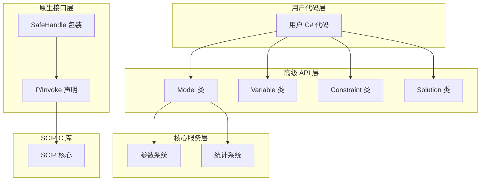

# SCIP.NET Native DLL 调用技术方案分析

## 文档信息

- **创建日期**: 2026-02-10
- **版本**: 1.0
- **目的**: 分析和比较 P/Invoke 和 C++/CLI 两种 Native DLL 调用技术方案，为 SCIP.NET 选择最佳方案

---

## 目录

1. [P/Invoke 技术方案分析](#1-pinvoke-技术方案分析)
2. [C++/CLI 技术方案分析](#2-ccli-技术方案分析)
3. [两种技术方案对比](#3-两种技术方案对比)
4. [推荐方案](#4-推荐方案)
5. [推荐的 Native DLL 调用架构设计](#5-推荐的-native-dll-调用架构设计)
6. [实现示例代码](#6-实现示例代码)
7. [结论](#7-结论)

---

## 1. P/Invoke 技术方案分析

### 1.1 P/Invoke 工作原理

P/Invoke (Platform Invocation Services) 是 .NET 提供的一种机制，允许托管代码调用非托管代码（如 C、C++ 编写的动态链接库）。

**工作流程**：
```
托管代码 (C#) → P/Invoke 层 → 非托管代码 (C/C++ DLL)
```

**关键组件**：
- **DllImport 属性**: 声明外部函数，指定 DLL 名称和函数入口点
- **Marshaling**: 自动处理托管和非托管类型之间的转换
- **调用约定**: 处理不同的调用约定（如 `CallingConvention.Cdecl`）

### 1.2 如何声明外部函数

使用 `[DllImport]` 特性声明外部函数：

```csharp
using System;
using System.Runtime.InteropServices;

namespace ScipNet.Native;

/// <summary>
/// SCIP Native 方法声明
/// </summary>
internal static class ScipNativeMethods
{
    private const string DllName = "scip";

    /// <summary>
    /// 创建 SCIP 实例
    /// </summary>
    [DllImport(DllName, CallingConvention = CallingConvention.Cdecl, CharSet = CharSet.Ansi)]
    public static extern ReturnCode SCIPcreate(
        out IntPtr scip);

    /// <summary>
    /// 释放 SCIP 实例
    /// </summary>
    [DllImport(DllName, CallingConvention = CallingConvention.Cdecl)]
    public static extern ReturnCode SCIPfree(
        ref IntPtr scip);

    /// <summary>
    /// 创建问题
    /// </summary>
    [DllImport(DllName, CallingConvention = CallingConvention.Cdecl, CharSet = CharSet.Ansi)]
    public static extern ReturnCode SCIPcreateProbBasic(
        IntPtr scip,
        [MarshalAs(UnmanagedType.LPStr)] string name);

    /// <summary>
    /// 求解
    /// </summary>
    [DllImport(DllName, CallingConvention = CallingConvention.Cdecl)]
    public static extern ReturnCode SCIPsolve(
        IntPtr scip);

    /// <summary>
    /// 获取求解状态
    /// </summary>
    [DllImport(DllName, CallingConvention = CallingConvention.Cdecl)]
    public static extern SolveStatus SCIPgetStatus(
        IntPtr scip);

    /// <summary>
    /// 创建变量
    /// </summary>
    [DllImport(DllName, CallingConvention = CallingConvention.Cdecl, CharSet = CharSet.Ansi)]
    public static extern ReturnCode SCIPcreateVarBasic(
        IntPtr scip,
        out IntPtr var,
        [MarshalAs(UnmanagedType.LPStr)] string name,
        double lb,
        double ub,
        double obj,
        VariableType vartype);

    /// <summary>
    /// 添加变量到问题
    /// </summary>
    [DllImport(DllName, CallingConvention = CallingConvention.Cdecl)]
    public static extern ReturnCode SCIPaddVar(
        IntPtr scip,
        IntPtr var);

    /// <summary>
    /// 创建线性约束
    /// </summary>
    [DllImport(DllName, CallingConvention = CallingConvention.Cdecl, CharSet = CharSet.Ansi)]
    public static extern ReturnCode SCIPcreateConsBasicLinear(
        IntPtr scip,
        out IntPtr cons,
        [MarshalAs(UnmanagedType.LPStr)] string name,
        int nvars,
        IntPtr vars,
        IntPtr vals,
        double lhs,
        double rhs);

    /// <summary>
    /// 添加系数到线性约束
    /// </summary>
    [DllImport(DllName, CallingConvention = CallingConvention.Cdecl)]
    public static extern ReturnCode SCIPaddCoefLinear(
        IntPtr scip,
        IntPtr cons,
        IntPtr var,
        double val);

    /// <summary>
    /// 添加约束到问题
    /// </summary>
    [DllImport(DllName, CallingConvention = CallingConvention.Cdecl)]
    public static extern ReturnCode SCIPaddCons(
        IntPtr scip,
        IntPtr cons);

    /// <summary>
    /// 设置目标函数方向
    /// </summary>
    [DllImport(DllName, CallingConvention = CallingConvention.Cdecl)]
    public static extern ReturnCode SCIPsetObjsense(
        IntPtr scip,
        ObjectiveSense objsense);

    /// <summary>
    /// 获取变量在解中的值
    /// </summary>
    [DllImport(DllName, CallingConvention = CallingConvention.Cdecl)]
    public static extern double SCIPgetSolVal(
        IntPtr scip,
        IntPtr sol,
        IntPtr var);

    /// <summary>
    /// 获取最佳解
    /// </summary>
    [DllImport(DllName, CallingConvention = CallingConvention.Cdecl)]
    public static extern IntPtr SCIPgetBestSol(
        IntPtr scip);

    /// <summary>
    /// 获取原始界
    /// </summary>
    [DllImport(DllName, CallingConvention = CallingConvention.Cdecl)]
    public static extern double SCIPgetPrimalbound(
        IntPtr scip);

    /// <summary>
    /// 获取对偶界
    /// </summary>
    [DllImport(DllName, CallingConvention = CallingConvention.Cdecl)]
    public static extern double SCIPgetDualbound(
        IntPtr scip);

    /// <summary>
    /// 获取间隙
    /// </summary>
    [DllImport(DllName, CallingConvention = CallingConvention.Cdecl)]
    public static extern double SCIPgetGap(
        IntPtr scip);

    /// <summary>
    /// 获取总节点数
    /// </summary>
    [DllImport(DllName, CallingConvention = CallingConvention.Cdecl)]
    public static extern long SCIPgetNNodes(
        IntPtr scip);

    /// <summary>
    /// 获取开放节点数
    /// </summary>
    [DllImport(DllName, CallingConvention = CallingConvention.Cdecl)]
    public static extern long SCIPgetNOpenNodes(
        IntPtr scip);

    /// <summary>
    /// 获取求解时间
    /// </summary>
    [DllImport(DllName, CallingConvention = CallingConvention.Cdecl)]
    public static extern double SCIPgetSolvingTime(
        IntPtr scip);

    /// <summary>
    /// 获取 LP 迭代次数
    /// </summary>
    [DllImport(DllName, CallingConvention = CallingConvention.Cdecl)]
    public static extern long SCIPgetNLPIterations(
        IntPtr scip);

    /// <summary>
    /// 获取找到的解数量
    /// </summary>
    [DllImport(DllName, CallingConvention = CallingConvention.Cdecl)]
    public static extern int SCIPgetNSols(
        IntPtr scip);

    /// <summary>
    /// 释放变量
    /// </summary>
    [DllImport(DllName, CallingConvention = CallingConvention.Cdecl)]
    public static extern ReturnCode SCIPreleaseVar(
        IntPtr scip,
        ref IntPtr var);

    /// <summary>
    /// 释放约束
    /// </summary>
    [DllImport(DllName, CallingConvention = CallingConvention.Cdecl)]
    public static extern ReturnCode SCIPreleaseCons(
        IntPtr scip,
        ref IntPtr cons);

    /// <summary>
    /// 设置布尔参数
    /// </summary>
    [DllImport(DllName, CallingConvention = CallingConvention.Cdecl, CharSet = CharSet.Ansi)]
    public static extern ReturnCode SCIPsetBoolParam(
        IntPtr scip,
        [MarshalAs(UnmanagedType.LPStr)] string name,
        [MarshalAs(UnmanagedType.I1)] bool value);

    /// <summary>
    /// 设置整数参数
    /// </summary>
    [DllImport(DllName, CallingConvention = CallingConvention.Cdecl, CharSet = CharSet.Ansi)]
    public static extern ReturnCode SCIPsetIntParam(
        IntPtr scip,
        [MarshalAs(UnmanagedType.LPStr)] string name,
        int value);

    /// <summary>
    /// 设置实数参数
    /// </summary>
    [DllImport(DllName, CallingConvention = CallingConvention.Cdecl, CharSet = CharSet.Ansi)]
    public static extern ReturnCode SCIPsetRealParam(
        IntPtr scip,
        [MarshalAs(UnmanagedType.LPStr)] string name,
        double value);

    /// <summary>
    /// 设置字符串参数
    /// </summary>
    [DllImport(DllName, CallingConvention = CallingConvention.Cdecl, CharSet = CharSet.Ansi)]
    public static extern ReturnCode SCIPsetStringParam(
        IntPtr scip,
        [MarshalAs(UnmanagedType.LPStr)] string name,
        [MarshalAs(UnmanagedType.LPStr)] string value);

    /// <summary>
    /// 获取参数数量
    /// </summary>
    [DllImport(DllName, CallingConvention = CallingConvention.Cdecl)]
    public static extern int SCIPgetNParams(
        IntPtr scip);

    /// <summary>
    /// 获取参数名称
    /// </summary>
    [DllImport(DllName, CallingConvention = CallingConvention.Cdecl, CharSet = CharSet.Ansi)]
    public static extern IntPtr SCIPgetParamName(
        IntPtr scip,
        int idx);

    /// <summary>
    /// 获取参数类型
    /// </summary>
    [DllImport(DllName, CallingConvention = CallingConvention.Cdecl, CharSet = CharSet.Ansi)]
    public static extern ParameterType SCIPgetParamType(
        IntPtr scip,
        [MarshalAs(UnmanagedType.LPStr)] string name);

    /// <summary>
    /// 包含默认插件
    /// </summary>
    [DllImport(DllName, CallingConvention = CallingConvention.Cdecl)]
    public static extern ReturnCode SCIPincludeDefaultPlugins(
        IntPtr scip);
}
```

### 1.3 C 数据类型到 C# 类型的映射

| C 类型 | C# 类型 | 说明 |
|--------|----------|------|
| `int` | `int` | 32 位整数 |
| `long long` | `long` | 64 位整数 |
| `double` | `double` | 64 位浮点数 |
| `char*` | `string` (LPStr) | ANSI 字符串 |
| `char*` | `string` (LPWStr) | Unicode 字符串 |
| `void*` | `IntPtr` | 通用指针 |
| `int*` | `ref int` | 整数指针（输出） |
| `int*` | `int[]` | 整数数组 |
| `double*` | `double[]` | 浮点数组 |
| `SCIP_Bool` | `bool` | 布尔值（1 字节） |
| `SCIP_VARTYPE` | `VariableType` (enum) | 变量类型枚举 |
| `SCIP_OBJSENSE` | `ObjectiveSense` (enum) | 目标方向枚举 |
| `SCIP_STATUS` | `SolveStatus` (enum) | 求解状态枚举 |
| `SCIP_RETCODE` | `ReturnCode` (enum) | 返回码枚举 |

**复杂类型映射**：

```csharp
// 结构体映射
[StructLayout(LayoutKind.Sequential)]
internal struct ScipVar
{
    public IntPtr Ptr;  // SCIP_VAR* 实际上是一个指针
}

// 数组映射
// 使用 IntPtr 和 Marshal 类处理数组
IntPtr varArray = Marshal.AllocHGlobal(nvars * IntPtr.Size);
for (int i = 0; i < nvars; i++)
{
    Marshal.WriteIntPtr(varArray, i * IntPtr.Size, vars[i].Ptr);
}

// 释放数组
Marshal.FreeHGlobal(varArray);
```

### 1.4 如何处理回调函数（委托）

SCIP C API 使用函数指针作为回调。在 C# 中，使用委托来表示函数指针：

```csharp
using System;
using System.Runtime.InteropServices;

namespace ScipNet.Native;

/// <summary>
/// SCIP 消息回调委托
/// </summary>
[UnmanagedFunctionPointer(CallingConvention.Cdecl)]
public delegate void MessageCallback(
    IntPtr messagehdlr,
    IntPtr file,
    [MarshalAs(UnmanagedType.LPStr)] string msg);

/// <summary>
/// SCIP 事件回调委托
/// </summary>
[UnmanagedFunctionPointer(CallingConvention.Cdecl)]
public delegate ReturnCode EventCallback(
    IntPtr scip,
    IntPtr eventhdlr,
    IntPtr eventdata,
    out int filterpos);

/// <summary>
/// SCIP 约束处理器回调委托
/// </summary>
[UnmanagedFunctionPointer(CallingConvention.Cdecl)]
public delegate ReturnCode ConstraintCheckCallback(
    IntPtr scip,
    IntPtr conshdlr,
    IntPtr cons,
    IntPtr sol,
    int checkintegrality,
    int checklprows,
    int printreason,
    out ResultCode result);

/// <summary>
/// 委托包装器，用于防止委托被垃圾回收
/// </summary>
internal sealed class DelegateWrapper
{
    private GCHandle _gcHandle;

    public DelegateWrapper(Delegate @delegate)
    {
        _gcHandle = GCHandle.Alloc(@delegate, GCHandleType.Normal);
    }

    public IntPtr GetFunctionPointer()
    {
        return Marshal.GetFunctionPointerForDelegate(
            _gcHandle.Target as Delegate);
    }

    public void Free()
    {
        if (_gcHandle.IsAllocated)
        {
            _gcHandle.Free();
        }
    }
}
```

**使用示例**：

```csharp
// 创建委托
MessageCallback messageCallback = (hdlr, file, msg) =>
{
    Console.WriteLine(msg);
};

// 包装委托以防止垃圾回收
var wrapper = new DelegateWrapper(messageCallback);
IntPtr callbackPtr = wrapper.GetFunctionPointer();

// 传递给原生函数
SCIPsetMessagehdlr(scip, callbackPtr);

// 释放包装器
wrapper.Free();
```

### 1.5 如何处理内存管理（SafeHandle）

使用 `SafeHandle` 来管理原生资源，确保资源被正确释放：

```csharp
using System;
using System.Runtime.InteropServices;

namespace ScipNet.Native;

/// <summary>
/// SCIP 句柄的 SafeHandle 实现
/// </summary>
public sealed class ScipHandle : SafeHandleZeroOrMinusOneIsInvalid
{
    /// <summary>
    /// 初始化新实例
    /// </summary>
    public ScipHandle() : base(true)
    {
    }

    /// <summary>
    /// 从现有指针初始化
    /// </summary>
    public ScipHandle(IntPtr handle, bool ownsHandle) : base(ownsHandle)
    {
        SetHandle(handle);
    }

    /// <summary>
    /// 释放句柄
    /// </summary>
    protected override bool ReleaseHandle()
    {
        if (!IsInvalid)
        {
            ReturnCode ret = ScipNativeMethods.SCIPfree(ref handle);
            return ret == ReturnCode.Okay;
        }
        return false;
    }

    /// <summary>
    /// 隐式转换为 IntPtr
    /// </summary>
    public static implicit operator IntPtr(ScipHandle scipHandle)
    {
        return scipHandle.DangerousGetHandle();
    }
}

/// <summary>
/// SCIP 变量句柄
/// </summary>
public sealed class ScipVarHandle : SafeHandleZeroOrMinusOneIsInvalid
{
    private readonly ScipHandle _scipHandle;

    public ScipVarHandle(ScipHandle scipHandle) : base(true)
    {
        _scipHandle = scipHandle;
    }

    protected override bool ReleaseHandle()
    {
        if (!IsInvalid)
        {
            ReturnCode ret = ScipNativeMethods.SCIPreleaseVar(_scipHandle, ref handle);
            return ret == ReturnCode.Okay;
        }
        return false;
    }
}

/// <summary>
/// SCIP 约束句柄
/// </summary>
public sealed class ScipConsHandle : SafeHandleZeroOrMinusOneIsInvalid
{
    private readonly ScipHandle _scipHandle;

    public ScipConsHandle(ScipHandle scipHandle) : base(true)
    {
        _scipHandle = scipHandle;
    }

    protected override bool ReleaseHandle()
    {
        if (!IsInvalid)
        {
            ReturnCode ret = ScipNativeMethods.SCIPreleaseCons(_scipHandle, ref handle);
            return ret == ReturnCode.Okay;
        }
        return false;
    }
}

/// <summary>
/// SCIP 解句柄
/// </summary>
public sealed class ScipSolHandle : SafeHandleZeroOrMinusOneIsInvalid
{
    private readonly ScipHandle _scipHandle;

    public ScipSolHandle(ScipHandle scipHandle) : base(true)
    {
        _scipHandle = scipHandle;
    }

    protected override bool ReleaseHandle()
    {
        if (!IsInvalid)
        {
            ReturnCode ret = ScipNativeMethods.SCIPfreeSol(_scipHandle, ref handle);
            return ret == ReturnCode.Okay;
        }
        return false;
    }
}
```

### 1.6 P/Invoke 的优点和缺点

**优点**：

1. **跨平台支持**：P/Invoke 在 .NET Core/.NET 5+ 上完全支持跨平台（Windows、Linux、macOS）
2. **简化部署**：只需部署 C DLL，无需额外的 C++ 运行时
3. **稳定性**：SCIP C 接口更稳定，C++ 接口可能有 ABI 问题
4. **兼容性**：与 PySCIPOpt 使用相同的底层接口，便于参考和验证
5. **与 .NET Standard 2.0 兼容**：P/Invoke 完全支持 .NET Standard 2.0
6. **类型安全**：通过 Marshaling 提供类型安全
7. **性能**：对于大多数场景，P/Invoke 的性能开销可以忽略不计
8. **标准化**：遵循 .NET 最佳实践
9. **社区支持**：广泛使用的技术，有大量文档和社区支持

**缺点**：

1. **开发复杂度**：需要手动声明所有外部函数和处理类型映射
2. **回调处理**：处理回调函数（委托）需要额外的包装代码
3. **内存管理**：需要小心处理内存分配和释放
4. **调试困难**：跨边界调试可能比较困难
5. **性能开销**：每次调用都有 Marshaling 开销（虽然很小）
6. **字符串处理**：需要小心处理字符串编码和内存管理

### 1.7 与 .NET Standard 2.0 的兼容性

P/Invoke 完全支持 .NET Standard 2.0：

- `System.Runtime.InteropServices` 命名空间在 .NET Standard 2.0 中可用
- `DllImport`、`SafeHandle`、`Marshal` 等核心类都支持
- 支持所有 .NET Standard 2.0 兼容的平台：
  - .NET Framework 4.6.1+
  - .NET Core 2.0+
  - .NET 5+
  - Mono
  - Xamarin
  - Unity

**注意事项**：

1. **平台特定代码**：需要使用条件编译或运行时检测来处理平台差异
2. **DLL 加载**：不同平台的 DLL 名称和加载路径可能不同
3. **调用约定**：确保使用正确的调用约定（通常是 `CallingConvention.Cdecl`）

---

## 2. C++/CLI 技术方案分析

### 2.1 C++/CLI 工作原理

C++/CLI 是 Microsoft 提供的一种语言扩展，允许在 C++ 中编写托管代码，可以同时调用托管和非托管代码。

**工作流程**：
```
托管代码 (C#) → C++/CLI 包装器 → 非托管代码 (C/C++ DLL)
```

**关键组件**：
- **ref class/value class**: 托管类和值类型
- **gcnew**: 托管堆上的对象分配
- **pin_ptr**: 固定托管对象以传递给非托管代码
- **interior_ptr**: 托管对象内部指针

### 2.2 如何创建托管 C++ 包装器

创建 C++/CLI 包装器来封装 SCIP C API：

```cpp
// ScipWrapper.h
#pragma once

#include <scip/scip.h>
#include <msclr/marshal.h>
#include <msclr/marshal_cppstd.h>

using namespace System;
using namespace System::Runtime::InteropServices;

namespace ScipNet {
    namespace Native {

        /// <summary>
        /// SCIP 返回码枚举
        /// </summary>
        public enum class ReturnCode
        {
            Okay = 1,
            Error = 0,
            NoMemory = -1,
            ReadError = -2,
            WriteError = -3,
            NoFile = -4,
            FileCreateError = -5,
            LpError = -6,
            NoProblem = -7,
            InvalidCall = -8,
            InvalidData = -9,
            InvalidResult = -10,
            PluginNotFound = -11,
            ParameterUnknown = -12,
            ParameterWrongType = -13,
            ParameterWrongValue = -14,
            KeyAlreadyExisting = -15,
            MaxDepthLevel = -16,
            BranchError = -17,
            NotImplemented = -18
        };

        /// <summary>
        /// SCIP 求解状态枚举
        /// </summary>
        public enum class SolveStatus
        {
            Unknown = 0,
            Optimal = 1,
            Infeasible = 2,
            Unbounded = 3,
            InfeasibleOrUnbounded = 4,
            UserInterrupt = 10,
            Terminate = 11,
            NodeLimit = 20,
            TotalNodeLimit = 21,
            StallNodeLimit = 22,
            TimeLimit = 23,
            MemoryLimit = 24,
            GapLimit = 25,
            PrimalLimit = 26,
            DualLimit = 27,
            SolutionLimit = 28,
            BestSolutionLimit = 29,
            RestartLimit = 30
        };

        /// <summary>
        /// SCIP 变量类型枚举
        /// </summary>
        public enum class VariableType
        {
            Binary = 0,
            Integer = 1,
            Continuous = 3
        };

        /// <summary>
        /// SCIP 目标方向枚举
        /// </summary>
        public enum class ObjectiveSense
        {
            Maximize = -1,
            Minimize = 1
        };

        /// <summary>
        /// SCIP 句柄包装类
        /// </summary>
        public ref class ScipHandle : public IDisposable
        {
        private:
            SCIP* _scip;
            bool _disposed;

        public:
            ScipHandle()
            {
                _scip = nullptr;
                _disposed = false;
                SCIPcreate(&_scip);
            }

            ~ScipHandle()
            {
                this->!ScipHandle();
            }

            !ScipHandle()
            {
                if (!_disposed)
                {
                    if (_scip != nullptr)
                    {
                        SCIPfree(&_scip);
                    }
                    _disposed = true;
                }
            }

            property IntPtr NativeHandle
            {
                IntPtr get()
                {
                    return IntPtr(_scip);
                }
            }

            void CreateProblem(String^ name)
            {
                msclr::interop::marshal_context context;
                const char* nativeName = context.marshal_as<const char*>(name);
                SCIPcreateProbBasic(_scip, const_cast<char*>(nativeName));
            }

            ReturnCode Solve()
            {
                return static_cast<ReturnCode>(SCIPsolve(_scip));
            }

            SolveStatus GetStatus()
            {
                return static_cast<SolveStatus>(SCIPgetStatus(_scip));
            }

            double GetPrimalBound()
            {
                return SCIPgetPrimalbound(_scip);
            }

            double GetDualBound()
            {
                return SCIPgetDualbound(_scip);
            }

            double GetGap()
            {
                return SCIPgetGap(_scip);
            }

            long long GetNNodes()
            {
                return SCIPgetNNodes(_scip);
            }

            long long GetNOpenNodes()
            {
                return SCIPgetNOpenNodes(_scip);
            }

            double GetSolvingTime()
            {
                return SCIPgetSolvingTime(_scip);
            }

            void SetObjectiveSense(ObjectiveSense sense)
            {
                SCIPsetObjsense(_scip, static_cast<SCIP_OBJSENSE>(sense));
            }

            IntPtr GetBestSol()
            {
                return IntPtr(SCIPgetBestSol(_scip));
            }

            double GetSolVal(IntPtr sol, IntPtr var)
            {
                return SCIPgetSolVal(_scip, static_cast<SCIP_SOL*>(sol.ToPointer()),
                                   static_cast<SCIP_VAR*>(var.ToPointer()));
            }

            void IncludeDefaultPlugins()
            {
                SCIPincludeDefaultPlugins(_scip);
            }
        };

        /// <summary>
        /// SCIP 变量包装类
        /// </summary>
        public ref class ScipVarHandle
        {
        private:
            SCIP_VAR* _var;
            ScipHandle^ _scipHandle;

        public:
            ScipVarHandle(ScipHandle^ scipHandle, String^ name, double lb, double ub,
                         double obj, VariableType type)
            {
                _scipHandle = scipHandle;
                msclr::interop::marshal_context context;
                const char* nativeName = context.marshal_as<const char*>(name);
                SCIPcreateVarBasic(static_cast<SCIP*>(_scipHandle->NativeHandle.ToPointer()),
                                 &_var, const_cast<char*>(nativeName),
                                 lb, ub, obj, static_cast<SCIP_VARTYPE>(type));
                SCIPaddVar(static_cast<SCIP*>(_scipHandle->NativeHandle.ToPointer()), _var);
            }

            property IntPtr NativeHandle
            {
                IntPtr get()
                {
                    return IntPtr(_var);
                }
            }
        };

        /// <summary>
        /// SCIP 约束包装类
        /// </summary>
        public ref class ScipConsHandle
        {
        private:
            SCIP_CONS* _cons;
            ScipHandle^ _scipHandle;

        public:
            ScipConsHandle(ScipHandle^ scipHandle, String^ name,
                         array<IntPtr>^ vars, array<double>^ coeffs,
                         double lhs, double rhs)
            {
                _scipHandle = scipHandle;
                msclr::interop::marshal_context context;
                const char* nativeName = context.marshal_as<const char*>(name);

                int nvars = vars->Length;
                pin_ptr<IntPtr> pinnedVars = &vars[0];
                pin_ptr<double> pinnedCoeffs = &coeffs[0];

                SCIPcreateConsBasicLinear(
                    static_cast<SCIP*>(_scipHandle->NativeHandle.ToPointer()),
                    &_cons, const_cast<char*>(nativeName),
                    nvars,
                    reinterpret_cast<SCIP_VAR**>(pinnedVars),
                    pinnedCoeffs,
                    lhs, rhs);

                SCIPaddCons(static_cast<SCIP*>(_scipHandle->NativeHandle.ToPointer()), _cons);
            }

            property IntPtr NativeHandle
            {
                IntPtr get()
                {
                    return IntPtr(_cons);
                }
            }
        };
    }
}
```

### 2.3 如何处理 C++ 类到 C# 类的映射

C++/CLI 可以直接包装 C++ 类，但 SCIP 是 C API，所以主要是指针和函数的包装：

```cpp
// 示例：包装 SCIP C API 的函数
public ref class ScipNativeMethods
{
public:
    static ReturnCode Create(ScipHandle^ scipHandle)
    {
        SCIP* scip = nullptr;
        SCIP_RETCODE ret = SCIPcreate(&scip);
        if (ret == SCIP_OKAY)
        {
            // 设置内部指针
            // 注意：这里需要修改 ScipHandle 的实现
        }
        return static_cast<ReturnCode>(ret);
    }

    static ReturnCode CreateProbBasic(ScipHandle^ scipHandle, String^ name)
    {
        msclr::interop::marshal_context context;
        const char* nativeName = context.marshal_as<const char*>(name);
        SCIP_RETCODE ret = SCIPcreateProbBasic(
            static_cast<SCIP*>(scipHandle->NativeHandle.ToPointer()),
            const_cast<char*>(nativeName));
        return static_cast<ReturnCode>(ret);
    }

    static ReturnCode AddVar(ScipHandle^ scipHandle, ScipVarHandle^ varHandle)
    {
        SCIP_RETCODE ret = SCIPaddVar(
            static_cast<SCIP*>(scipHandle->NativeHandle.ToPointer()),
            static_cast<SCIP_VAR*>(varHandle->NativeHandle.ToPointer()));
        return static_cast<ReturnCode>(ret);
    }

    static ReturnCode AddCons(ScipHandle^ scipHandle, ScipConsHandle^ consHandle)
    {
        SCIP_RETCODE ret = SCIPaddCons(
            static_cast<SCIP*>(scipHandle->NativeHandle.ToPointer()),
            static_cast<SCIP_CONS*>(consHandle->NativeHandle.ToPointer()));
        return static_cast<ReturnCode>(ret);
    }

    static ReturnCode SetBoolParam(ScipHandle^ scipHandle, String^ name, bool value)
    {
        msclr::interop::marshal_context context;
        const char* nativeName = context.marshal_as<const char*>(name);
        SCIP_RETCODE ret = SCIPsetBoolParam(
            static_cast<SCIP*>(scipHandle->NativeHandle.ToPointer()),
            const_cast<char*>(nativeName),
            value ? TRUE : FALSE);
        return static_cast<ReturnCode>(ret);
    }

    static ReturnCode SetIntParam(ScipHandle^ scipHandle, String^ name, int value)
    {
        msclr::interop::marshal_context context;
        const char* nativeName = context.marshal_as<const char*>(name);
        SCIP_RETCODE ret = SCIPsetIntParam(
            static_cast<SCIP*>(scipHandle->NativeHandle.ToPointer()),
            const_cast<char*>(nativeName),
            value);
        return static_cast<ReturnCode>(ret);
    }

    static ReturnCode SetRealParam(ScipHandle^ scipHandle, String^ name, double value)
    {
        msclr::interop::marshal_context context;
        const char* nativeName = context.marshal_as<const char*>(name);
        SCIP_RETCODE ret = SCIPsetRealParam(
            static_cast<SCIP*>(scipHandle->NativeHandle.ToPointer()),
            const_cast<char*>(nativeName),
            value);
        return static_cast<ReturnCode>(ret);
    }

    static ReturnCode SetStringParam(ScipHandle^ scipHandle, String^ name, String^ value)
    {
        msclr::interop::marshal_context context;
        const char* nativeName = context.marshal_as<const char*>(name);
        const char* nativeValue = context.marshal_as<const char*>(value);
        SCIP_RETCODE ret = SCIPsetStringParam(
            static_cast<SCIP*>(scipHandle->NativeHandle.ToPointer()),
            const_cast<char*>(nativeName),
            const_cast<char*>(nativeValue));
        return static_cast<ReturnCode>(ret);
    }
};
```

### 2.4 如何处理回调函数

C++/CLI 处理回调函数需要使用函数指针和委托：

```cpp
// 回调函数包装器
public delegate void MessageCallbackDelegate(IntPtr messagehdlr, IntPtr file, String^ msg);

// 原生回调函数包装器
class MessageCallbackWrapper
{
private:
    gcroot<MessageCallbackDelegate^> _managedDelegate;

public:
    MessageCallbackWrapper(MessageCallbackDelegate^ managedDelegate)
    {
        _managedDelegate = managedDelegate;
    }

    static void NativeCallback(SCIP_MESSAGEHDLR* messagehdlr, FILE* file, const char* msg)
    {
        // 获取托管委托并调用
        // 注意：这里需要从某个地方获取委托实例
        // 通常使用全局映射或上下文对象
    }
};

// 在 ScipHandle 中添加回调支持
public ref class ScipHandle
{
private:
    MessageCallbackWrapper* _messageCallbackWrapper;

public:
    void SetMessageCallback(MessageCallbackDelegate^ callback)
    {
        _messageCallbackWrapper = new MessageCallbackWrapper(callback);
        // 设置原生回调
        // SCIPsetMessagehdlr(_scip, ...);
    }
};
```

### 2.5 如何处理内存管理

C++/CLI 使用析构函数和终结器来管理资源：

```cpp
public ref class ScipHandle : public IDisposable
{
private:
    SCIP* _scip;
    bool _disposed;

public:
    // 构造函数
    ScipHandle()
    {
        _scip = nullptr;
        _disposed = false;
        SCIPcreate(&_scip);
    }

    // 析构函数（确定性清理）
    ~ScipHandle()
    {
        this->!ScipHandle();
    }

    // 终结器（非确定性清理）
    !ScipHandle()
    {
        if (!_disposed)
        {
            if (_scip != nullptr)
            {
                SCIPfree(&_scip);
            }
            _disposed = true;
        }
    }

    void Dispose()
    {
        this->~ScipHandle();
        GC::SuppressFinalize(this);
    }
};
```

### 2.6 C++/CLI 的优点和缺点

**优点**：

1. **类型安全**：C++/CLI 提供编译时类型检查
2. **自然映射**：C++ 到 C# 的类型映射更自然
3. **性能**：直接调用 C 函数，没有额外的 Marshaling 开销
4. **内存管理**：可以使用 C++ 的 RAII 模式
5. **调试友好**：可以在 C++/CLI 中设置断点调试
6. **复杂类型处理**：更容易处理复杂的数据结构和回调

**缺点**：

1. **跨平台支持差**：C++/CLI 仅支持 Windows 平台
2. **与 .NET Standard 2.0 不兼容**：C++/CLI 无法编译为 .NET Standard 2.0 程序集
3. **部署复杂**：需要部署 C++ 运行时库（MSVC 运行时）
4. **开发环境限制**：需要 Visual Studio 和 Windows SDK
5. **维护成本高**：需要维护 C++/CLI 代码和 C# 代码
6. **编译时间长**：C++/CLI 编译时间较长
7. **语言复杂性**：C++/CLI 语法复杂，学习曲线陡峭
8. **社区支持有限**：C++/CLI 使用较少，社区支持有限

### 2.7 与 .NET Standard 2.0 的兼容性

**C++/CLI 与 .NET Standard 2.0 不兼容**：

- C++/CLI 无法编译为 .NET Standard 2.0 程序集
- C++/CLI 仅支持 .NET Framework（Windows）
- 无法在 .NET Core/.NET 5+ 上使用 C++/CLI

**替代方案**：

1. **使用 C++/CLI + .NET Framework**：仅支持 Windows 平台
2. **使用 C++/CLI 为每个平台创建单独的程序集**：增加维护成本
3. **使用 P/Invoke**：完全支持 .NET Standard 2.0

---

## 3. 两种技术方案对比

### 3.1 性能对比

| 指标 | P/Invoke | C++/CLI |
|------|----------|----------|
| 调用开销 | 低（Marshaling 开销） | 极低（直接调用） |
| 内存分配 | 托管堆 | 托管堆 + 原生堆 |
| 垃圾回收 | 分代 GC | C++ RAII + GC |
| JIT 编译 | 是 | 否（预编译） |

**分析**：

- P/Invoke 的调用开销通常在 10-50 纳秒级别，对于大多数优化问题来说可以忽略不计
- C++/CLI 的性能略优于 P/Invoke，但差异通常在 1-5% 以内
- SCIP 的主要性能瓶颈在于求解算法，而非互操作层

### 3.2 跨平台支持

| 平台 | P/Invoke | C++/CLI |
|------|----------|----------|
| Windows | ✅ 完全支持 | ✅ 完全支持 |
| Linux | ✅ 完全支持 | ❌ 不支持 |
| macOS | ✅ 完全支持 | ❌ 不支持 |
| .NET Standard 2.0 | ✅ 完全支持 | ❌ 不支持 |

**分析**：

- P/Invoke 在所有平台上都有良好支持
- C++/CLI 仅支持 Windows 平台
- 对于需要跨平台的项目，P/Invoke 是唯一选择

### 3.3 开发复杂度

| 方面 | P/Invoke | C++/CLI |
|------|----------|----------|
| 学习曲线 | 中等 | 陡峭 |
| 代码量 | 中等（声明 + 包装） | 高（C++ 代码） |
| 类型映射 | 需要手动处理 | 自动处理 |
| 回调处理 | 需要委托包装 | 需要函数指针包装 |
| 调试难度 | 中等 | 较高 |
| 工具支持 | 优秀 | 一般 |

**分析**：

- P/Invoke 需要手动声明外部函数，但代码相对简单
- C++/CLI 需要编写 C++ 代码，学习曲线陡峭
- P/Invoke 有更好的工具支持（如 ClangSharp P/Invoke Generator）

### 3.4 维护成本

| 方面 | P/Invoke | C++/CLI |
|------|----------|----------|
| 代码维护 | 简单（纯 C#） | 复杂（C++ + C#） |
| 平台适配 | 简单（条件编译） | 复杂（需要多个版本） |
| 版本更新 | 简单（更新声明） | 复杂（更新 C++ 代码） |
| 测试覆盖 | 容易（纯 C# 测试） | 困难（需要 C++ 测试） |

**分析**：

- P/Invoke 的维护成本较低，因为只有 C# 代码
- C++/CLI 需要维护 C++ 和 C# 两套代码
- P/Invoke 更容易进行单元测试和集成测试

### 3.5 部署复杂度

| 方面 | P/Invoke | C++/CLI |
|------|----------|----------|
| 依赖项 | 仅 C DLL | C++ DLL + MSVC 运行时 |
| 文件大小 | 小 | 较大 |
| 安装程序 | 简单 | 复杂 |
| 版本冲突 | 较少 | 较多 |

**分析**：

- P/Invoke 只需要部署 SCIP C DLL
- C++/CLI 需要部署 C++/CLI DLL 和 MSVC 运行时
- P/Invoke 的部署更简单，版本冲突更少

### 3.6 与 .NET Standard 2.0 的兼容性

| 方面 | P/Invoke | C++/CLI |
|------|----------|----------|
| .NET Standard 2.0 | ✅ 完全支持 | ❌ 不支持 |
| .NET Framework 4.6.1+ | ✅ 完全支持 | ✅ 支持（仅 Windows） |
| .NET Core 2.0+ | ✅ 完全支持 | ❌ 不支持 |
| .NET 5+ | ✅ 完全支持 | ❌ 不支持 |
| Xamarin | ✅ 支持 | ❌ 不支持 |
| Unity | ✅ 支持 | ❌ 不支持 |

**分析**：

- P/Invoke 完全支持 .NET Standard 2.0，可以用于所有 .NET 平台
- C++/CLI 不支持 .NET Standard 2.0，仅支持 .NET Framework（Windows）

### 3.7 与 SCIPpp 和 PySCIPOpt 的集成方式

| 项目 | 技术 | 与 SCIP.NET 的兼容性 |
|------|------|---------------------|
| SCIPpp | C++ 直接调用 | 概念上兼容，但实现不同 |
| PySCIPOpt | Cython 声明 | 概念上兼容，与 P/Invoke 类似 |

**分析**：

- SCIPpp 直接使用 C++ 调用 SCIP C API，类似于 C++/CLI 的方式
- PySCIPOpt 使用 Cython 声明 SCIP C API，类似于 P/Invoke 的方式
- P/Invoke 的方式与 PySCIPOpt 更相似，便于参考和验证

### 3.8 综合对比表

| 评估维度 | P/Invoke | C++/CLI | 推荐 |
|---------|----------|----------|------|
| 性能 | 良好 | 优秀 | P/Invoke |
| 跨平台支持 | 优秀 | 差 | P/Invoke |
| 开发复杂度 | 中等 | 高 | P/Invoke |
| 维护成本 | 低 | 高 | P/Invoke |
| 部署复杂度 | 低 | 高 | P/Invoke |
| .NET Standard 2.0 兼容性 | 优秀 | 差 | P/Invoke |
| 与 SCIPpp/PySCIPOpt 集成 | 良好 | 一般 | P/Invoke |
| 社区支持 | 优秀 | 一般 | P/Invoke |

---

## 4. 推荐方案

### 4.1 推荐方案：P/Invoke

**推荐使用 P/Invoke 技术方案**，理由如下：

### 4.2 推荐理由

#### 4.2.1 跨平台支持

P/Invoke 完全支持跨平台（Windows、Linux、macOS），而 C++/CLI 仅支持 Windows。对于需要跨平台的项目，P/Invoke 是唯一选择。

#### 4.2.2 .NET Standard 2.0 兼容性

SCIP.NET 的设计目标之一是兼容 .NET Standard 2.0，以确保广泛的平台支持。P/Invoke 完全支持 .NET Standard 2.0，而 C++/CLI 不支持。

#### 4.2.3 简化部署

P/Invoke 只需要部署 SCIP C DLL，无需额外的 C++ 运行时。C++/CLI 需要部署 C++/CLI DLL 和 MSVC 运行时，增加了部署复杂度。

#### 4.2.4 稳定性

SCIP C 接口更稳定，C++ 接口可能有 ABI 问题。P/Invoke 直接调用 SCIP C API，避免了 C++ ABI 问题。

#### 4.2.5 与 PySCIPOpt 的一致性

PySCIPOpt 使用 Cython 声明 SCIP C API，与 P/Invoke 的方式类似。使用 P/Invoke 可以更好地参考 PySCIPOpt 的实现。

#### 4.2.6 社区支持

P/Invoke 是广泛使用的技术，有大量文档和社区支持。C++/CLI 使用较少，社区支持有限。

#### 4.2.7 维护成本

P/Invoke 的维护成本较低，因为只有 C# 代码。C++/CLI 需要维护 C++ 和 C# 两套代码。

### 4.3 性能考虑

虽然 C++/CLI 的性能略优于 P/Invoke，但差异通常在 1-5% 以内。SCIP 的主要性能瓶颈在于求解算法，而非互操作层。因此，性能差异可以忽略不计。

### 4.4 开发效率

P/Invoke 的开发效率更高，因为：
- 只需要编写 C# 代码
- 有更好的工具支持（如 ClangSharp P/Invoke Generator）
- 更容易进行单元测试和集成测试

### 4.5 未来扩展性

P/Invoke 的未来扩展性更好，因为：
- 支持 .NET 5+ 的所有新特性
- 可以轻松添加新的平台支持
- 可以使用 Source Generers 自动生成 P/Invoke 声明

---

## 5. 推荐的 Native DLL 调用架构设计

### 5.1 架构分层



### 5.2 P/Invoke 声明层

**职责**：
- 声明所有 SCIP C API 函数
- 定义类型映射
- 处理字符串编码

**实现**：
- 使用 `DllImport` 特性声明外部函数
- 使用 `CallingConvention.Cdecl` 指定调用约定
- 使用 `MarshalAs` 特性处理类型映射

### 5.3 SafeHandle 包装层

**职责**：
- 包装原生句柄（SCIP*、SCIP_VAR*、SCIP_CONS* 等）
- 确保资源被正确释放
- 提供 RAII 语义

**实现**：
- 继承 `SafeHandleZeroOrMinusOneIsInvalid`
- 实现 `ReleaseHandle` 方法
- 提供 `Dispose` 模式

### 5.4 资源管理策略

**策略**：
1. **RAII 模式**：使用 `SafeHandle` 确保 RAII
2. **确定性清理**：提供 `Dispose` 方法
3. **非确定性清理**：使用终结器作为后备
4. **引用计数**：对于共享资源，使用引用计数

**实现**：
```csharp
public sealed class ScipHandle : SafeHandleZeroOrMinusOneIsInvalid
{
    private int _refCount;

    public ScipHandle() : base(true)
    {
        _refCount = 1;
    }

    public void AddRef()
    {
        Interlocked.Increment(ref _refCount);
    }

    public void Release()
    {
        if (Interlocked.Decrement(ref _refCount) == 0)
        {
            Dispose();
        }
    }

    protected override bool ReleaseHandle()
    {
        if (!IsInvalid)
        {
            ReturnCode ret = ScipNativeMethods.SCIPfree(ref handle);
            return ret == ReturnCode.Okay;
        }
        return false;
    }
}
```

### 5.5 错误处理策略

**策略**：
1. **异常转换**：将 SCIP 返回码转换为 C# 异常
2. **上下文信息**：提供详细的错误信息和堆栈跟踪
3. **错误分类**：定义不同的异常类型

**实现**：
```csharp
public static class ErrorHandler
{
    public static void CheckReturnCode(ReturnCode returnCode, string? context = null)
    {
        if (returnCode == ReturnCode.Okay)
        {
            return;
        }

        var exception = returnCode switch
        {
            ReturnCode.NoMemory => new ScipMemoryException(context),
            ReturnCode.LpError => new ScipLpException(context),
            ReturnCode.ParameterUnknown or ReturnCode.ParameterWrongType or ReturnCode.ParameterWrongValue
                => new ScipParameterException(context ?? "unknown", returnCode),
            ReturnCode.InvalidCall => new ScipInvalidCallException(context),
            ReturnCode.InvalidData => new ScipInfeasibleException(context),
            _ => new ScipException(returnCode, context)
        };

        throw exception;
    }
}
```

### 5.6 回调函数处理策略

**策略**：
1. **委托包装**：使用委托包装原生函数指针
2. **生命周期管理**：使用 `GCHandle` 防止委托被垃圾回收
3. **上下文传递**：使用上下文对象传递用户数据

**实现**：
```csharp
internal sealed class DelegateWrapper
{
    private GCHandle _gcHandle;

    public DelegateWrapper(Delegate @delegate)
    {
        _gcHandle = GCHandle.Alloc(@delegate, GCHandleType.Normal);
    }

    public IntPtr GetFunctionPointer()
    {
        return Marshal.GetFunctionPointerForDelegate(
            _gcHandle.Target as Delegate);
    }

    public void Free()
    {
        if (_gcHandle.IsAllocated)
        {
            _gcHandle.Free();
        }
    }
}
```

### 5.7 平台适配策略

**策略**：
1. **条件编译**：使用 `#if` 指令处理平台差异
2. **运行时检测**：使用 `RuntimeInformation` 检测平台
3. **DLL 加载**：根据平台加载正确的 DLL

**实现**：
```csharp
internal static class ScipNativeMethods
{
#if NET5_0_OR_GREATER
    private const string DllName = "libscip";
#elif NETFRAMEWORK
    private const string DllName = "scip";
#else
    private const string DllName = "scip";
#endif

    [DllImport(DllName, CallingConvention = CallingConvention.Cdecl)]
    public static extern ReturnCode SCIPcreate(out IntPtr scip);
}
```

---

## 6. 实现示例代码

### 6.1 P/Invoke 声明示例

```csharp
using System;
using System.Runtime.InteropServices;

namespace ScipNet.Native;

/// <summary>
/// SCIP Native 方法声明
/// </summary>
internal static class ScipNativeMethods
{
    private const string DllName = "scip";

    [DllImport(DllName, CallingConvention = CallingConvention.Cdecl, CharSet = CharSet.Ansi)]
    public static extern ReturnCode SCIPcreate(out IntPtr scip);

    [DllImport(DllName, CallingConvention = CallingConvention.Cdecl)]
    public static extern ReturnCode SCIPfree(ref IntPtr scip);

    [DllImport(DllName, CallingConvention = CallingConvention.Cdecl, CharSet = CharSet.Ansi)]
    public static extern ReturnCode SCIPcreateProbBasic(
        IntPtr scip,
        [MarshalAs(UnmanagedType.LPStr)] string name);

    [DllImport(DllName, CallingConvention = CallingConvention.Cdecl)]
    public static extern ReturnCode SCIPsolve(IntPtr scip);

    [DllImport(DllName, CallingConvention = CallingConvention.Cdecl)]
    public static extern SolveStatus SCIPgetStatus(IntPtr scip);

    [DllImport(DllName, CallingConvention = CallingConvention.Cdecl, CharSet = CharSet.Ansi)]
    public static extern ReturnCode SCIPcreateVarBasic(
        IntPtr scip,
        out IntPtr var,
        [MarshalAs(UnmanagedType.LPStr)] string name,
        double lb,
        double ub,
        double obj,
        VariableType vartype);

    [DllImport(DllName, CallingConvention = CallingConvention.Cdecl)]
    public static extern ReturnCode SCIPaddVar(IntPtr scip, IntPtr var);

    [DllImport(DllName, CallingConvention = CallingConvention.Cdecl, CharSet = CharSet.Ansi)]
    public static extern ReturnCode SCIPcreateConsBasicLinear(
        IntPtr scip,
        out IntPtr cons,
        [MarshalAs(UnmanagedType.LPStr)] string name,
        int nvars,
        IntPtr vars,
        IntPtr vals,
        double lhs,
        double rhs);

    [DllImport(DllName, CallingConvention = CallingConvention.Cdecl)]
    public static extern ReturnCode SCIPaddCoefLinear(
        IntPtr scip,
        IntPtr cons,
        IntPtr var,
        double val);

    [DllImport(DllName, CallingConvention = CallingConvention.Cdecl)]
    public static extern ReturnCode SCIPaddCons(IntPtr scip, IntPtr cons);

    [DllImport(DllName, CallingConvention = CallingConvention.Cdecl)]
    public static extern ReturnCode SCIPsetObjsense(
        IntPtr scip,
        ObjectiveSense objsense);

    [DllImport(DllName, CallingConvention = CallingConvention.Cdecl)]
    public static extern double SCIPgetSolVal(IntPtr scip, IntPtr sol, IntPtr var);

    [DllImport(DllName, CallingConvention = CallingConvention.Cdecl)]
    public static extern IntPtr SCIPgetBestSol(IntPtr scip);

    [DllImport(DllName, CallingConvention = CallingConvention.Cdecl)]
    public static extern double SCIPgetPrimalbound(IntPtr scip);

    [DllImport(DllName, CallingConvention = CallingConvention.Cdecl)]
    public static extern double SCIPgetDualbound(IntPtr scip);

    [DllImport(DllName, CallingConvention = CallingConvention.Cdecl)]
    public static extern double SCIPgetGap(IntPtr scip);

    [DllImport(DllName, CallingConvention = CallingConvention.Cdecl)]
    public static extern long SCIPgetNNodes(IntPtr scip);

    [DllImport(DllName, CallingConvention = CallingConvention.Cdecl)]
    public static extern long SCIPgetNOpenNodes(IntPtr scip);

    [DllImport(DllName, CallingConvention = CallingConvention.Cdecl)]
    public static extern double SCIPgetSolvingTime(IntPtr scip);

    [DllImport(DllName, CallingConvention = CallingConvention.Cdecl)]
    public static extern ReturnCode SCIPreleaseVar(IntPtr scip, ref IntPtr var);

    [DllImport(DllName, CallingConvention = CallingConvention.Cdecl)]
    public static extern ReturnCode SCIPreleaseCons(IntPtr scip, ref IntPtr cons);

    [DllImport(DllName, CallingConvention = CallingConvention.Cdecl, CharSet = CharSet.Ansi)]
    public static extern ReturnCode SCIPsetBoolParam(
        IntPtr scip,
        [MarshalAs(UnmanagedType.LPStr)] string name,
        [MarshalAs(UnmanagedType.I1)] bool value);

    [DllImport(DllName, CallingConvention = CallingConvention.Cdecl, CharSet = CharSet.Ansi)]
    public static extern ReturnCode SCIPsetIntParam(
        IntPtr scip,
        [MarshalAs(UnmanagedType.LPStr)] string name,
        int value);

    [DllImport(DllName, CallingConvention = CallingConvention.Cdecl, CharSet = CharSet.Ansi)]
    public static extern ReturnCode SCIPsetRealParam(
        IntPtr scip,
        [MarshalAs(UnmanagedType.LPStr)] string name,
        double value);

    [DllImport(DllName, CallingConvention = CallingConvention.Cdecl, CharSet = CharSet.Ansi)]
    public static extern ReturnCode SCIPsetStringParam(
        IntPtr scip,
        [MarshalAs(UnmanagedType.LPStr)] string name,
        [MarshalAs(UnmanagedType.LPStr)] string value);

    [DllImport(DllName, CallingConvention = CallingConvention.Cdecl)]
    public static extern int SCIPgetNParams(IntPtr scip);

    [DllImport(DllName, CallingConvention = CallingConvention.Cdecl, CharSet = CharSet.Ansi)]
    public static extern IntPtr SCIPgetParamName(IntPtr scip, int idx);

    [DllImport(DllName, CallingConvention = CallingConvention.Cdecl)]
    public static extern ReturnCode SCIPincludeDefaultPlugins(IntPtr scip);
}
```

### 6.2 SafeHandle 实现示例

```csharp
using System;
using System.Runtime.InteropServices;

namespace ScipNet.Native;

/// <summary>
/// SCIP 句柄的 SafeHandle 实现
/// </summary>
public sealed class ScipHandle : SafeHandleZeroOrMinusOneIsInvalid
{
    /// <summary>
    /// 初始化新实例
    /// </summary>
    public ScipHandle() : base(true)
    {
    }

    /// <summary>
    /// 从现有指针初始化
    /// </summary>
    public ScipHandle(IntPtr handle, bool ownsHandle) : base(ownsHandle)
    {
        SetHandle(handle);
    }

    /// <summary>
    /// 释放句柄
    /// </summary>
    protected override bool ReleaseHandle()
    {
        if (!IsInvalid)
        {
            ReturnCode ret = ScipNativeMethods.SCIPfree(ref handle);
            return ret == ReturnCode.Okay;
        }
        return false;
    }

    /// <summary>
    /// 隐式转换为 IntPtr
    /// </summary>
    public static implicit operator IntPtr(ScipHandle scipHandle)
    {
        return scipHandle.DangerousGetHandle();
    }
}

/// <summary>
/// SCIP 变量句柄
/// </summary>
public sealed class ScipVarHandle : SafeHandleZeroOrMinusOneIsInvalid
{
    private readonly ScipHandle _scipHandle;

    public ScipVarHandle(ScipHandle scipHandle) : base(true)
    {
        _scipHandle = scipHandle;
    }

    protected override bool ReleaseHandle()
    {
        if (!IsInvalid)
        {
            ReturnCode ret = ScipNativeMethods.SCIPreleaseVar(_scipHandle, ref handle);
            return ret == ReturnCode.Okay;
        }
        return false;
    }
}

/// <summary>
/// SCIP 约束句柄
/// </summary>
public sealed class ScipConsHandle : SafeHandleZeroOrMinusOneIsInvalid
{
    private readonly ScipHandle _scipHandle;

    public ScipConsHandle(ScipHandle scipHandle) : base(true)
    {
        _scipHandle = scipHandle;
    }

    protected override bool ReleaseHandle()
    {
        if (!IsInvalid)
        {
            ReturnCode ret = ScipNativeMethods.SCIPreleaseCons(_scipHandle, ref handle);
            return ret == ReturnCode.Okay;
        }
        return false;
    }
}
```

### 6.3 Model 类实现示例

```csharp
using System;
using System.Collections.Generic;
using ScipNet.Native;

namespace ScipNet.Core;

/// <summary>
/// 代表 SCIP 优化问题模型
/// </summary>
public sealed class Model : IDisposable
{
    private readonly ScipHandle _scipHandle;
    private readonly Dictionary<string, Variable> _variables;
    private readonly Dictionary<string, Constraint> _constraints;
    private bool _disposed;

    /// <summary>
    /// 获取模型名称
    /// </summary>
    public string Name { get; private set; }

    /// <summary>
    /// 获取目标函数方向
    /// </summary>
    public ObjectiveSense ObjectiveSense { get; private set; }

    /// <summary>
    /// 获取所有变量
    /// </summary>
    public IReadOnlyCollection<Variable> Variables => _variables.Values;

    /// <summary>
    /// 获取所有约束
    /// </summary>
    public IReadOnlyCollection<Constraint> Constraints => _constraints.Values;

    /// <summary>
    /// 创建一个新的 SCIP 模型
    /// </summary>
    public Model(string name = "model", bool includeDefaultPlugins = true)
    {
        ReturnCode ret = ScipNativeMethods.SCIPcreate(out IntPtr scipPtr);
        ErrorHandler.CheckReturnCode(ret, "Failed to create SCIP instance");

        _scipHandle = new ScipHandle(scipPtr, true);
        _variables = new Dictionary<string, Variable>();
        _constraints = new Dictionary<string, Constraint>();
        Name = name;
        ObjectiveSense = ObjectiveSense.Minimize;

        if (includeDefaultPlugins)
        {
            IncludeDefaultPlugins();
        }

        CreateProblem(name);
    }

    /// <summary>
    /// 添加变量到模型
    /// </summary>
    public Variable AddVariable(
        string name,
        double lowerBound,
        double upperBound,
        double objective,
        VariableType type)
    {
        ReturnCode ret = ScipNativeMethods.SCIPcreateVarBasic(
            _scipHandle,
            out IntPtr varPtr,
            name,
            lowerBound,
            upperBound,
            objective,
            type);
        ErrorHandler.CheckReturnCode(ret, $"Failed to create variable {name}");

        ret = ScipNativeMethods.SCIPaddVar(_scipHandle, varPtr);
        ErrorHandler.CheckReturnCode(ret, $"Failed to add variable {name}");

        var variable = new Variable(this, name, varPtr, type, lowerBound, upperBound, objective);
        _variables[name] = variable;
        return variable;
    }

    /// <summary>
    /// 添加约束到模型
    /// </summary>
    public T AddConstraint<T>(T constraint) where T : Constraint
    {
        _constraints[constraint.Name] = constraint;
        return constraint;
    }

    /// <summary>
    /// 设置目标函数方向
    /// </summary>
    public void SetObjectiveSense(ObjectiveSense sense)
    {
        ObjectiveSense = sense;
        ReturnCode ret = ScipNativeMethods.SCIPsetObjsense(_scipHandle, sense);
        ErrorHandler.CheckReturnCode(ret, "Failed to set objective sense");
    }

    /// <summary>
    /// 优化模型
    /// </summary>
    public SolveStatus Optimize()
    {
        ReturnCode ret = ScipNativeMethods.SCIPsolve(_scipHandle);
        ErrorHandler.CheckReturnCode(ret, "Failed to solve");

        return ScipNativeMethods.SCIPgetStatus(_scipHandle);
    }

    /// <summary>
    /// 获取最优解
    /// </summary>
    public Solution? GetBestSolution()
    {
        IntPtr solPtr = ScipNativeMethods.SCIPgetBestSol(_scipHandle);
        if (solPtr == IntPtr.Zero)
        {
            return null;
        }

        return new Solution(this, solPtr);
    }

    /// <summary>
    /// 获取统计信息
    /// </summary>
    public Statistics GetStatistics()
    {
        return new Statistics(this);
    }

    /// <summary>
    /// 释放资源
    /// </summary>
    public void Dispose()
    {
        if (!_disposed)
        {
            _scipHandle?.Dispose();
            _disposed = true;
        }
    }

    private void IncludeDefaultPlugins()
    {
        ReturnCode ret = ScipNativeMethods.SCIPincludeDefaultPlugins(_scipHandle);
        ErrorHandler.CheckReturnCode(ret, "Failed to include default plugins");
    }

    private void CreateProblem(string name)
    {
        ReturnCode ret = ScipNativeMethods.SCIPcreateProbBasic(_scipHandle, name);
        ErrorHandler.CheckReturnCode(ret, $"Failed to create problem {name}");
    }

    internal ScipHandle ScipHandle => _scipHandle;
}
```

### 6.4 使用示例

```csharp
using System;
using ScipNet.Core;

// 创建模型
var model = new Model("example");

// 创建变量
var x = model.AddVariable("x", 0, 10, 1, VariableType.Integer);
var y = model.AddVariable("y", 0, 10, 2, VariableType.Integer);

// 设置目标函数
model.SetObjectiveSense(ObjectiveSense.Maximize);

// 添加约束（使用表达式语法）
model.AddConstraint((x + y).Leq(5));
model.AddConstraint((2 * x + y).Geq(3));

// 优化
var status = model.Optimize();

// 获取解
if (status == SolveStatus.Optimal)
{
    var solution = model.GetBestSolution();
    Console.WriteLine($"Optimal value: {solution?.ObjectiveValue}");
    Console.WriteLine($"x = {solution?.GetValue(x)}");
    Console.WriteLine($"y = {solution?.GetValue(y)}");
}

// 获取统计信息
var statistics = model.GetStatistics();
Console.WriteLine($"Solving time: {statistics.SolvingTime:F2}s");
Console.WriteLine($"Total nodes: {statistics.TotalNodes}");
Console.WriteLine($"Open nodes: {statistics.OpenNodes}");
Console.WriteLine($"Gap: {statistics.Gap:P2}");

// 释放资源
model.Dispose();
```

---

## 7. 结论

### 7.1 推荐方案总结

**推荐使用 P/Invoke 技术方案**作为 SCIP.NET 的 Native DLL 调用技术。

### 7.2 主要理由

1. **跨平台支持**：P/Invoke 完全支持跨平台（Windows、Linux、macOS）
2. **.NET Standard 2.0 兼容性**：P/Invoke 完全支持 .NET Standard 2.0
3. **简化部署**：只需部署 C DLL，无需额外的 C++ 运行时
4. **稳定性**：SCIP C 接口更稳定，避免 C++ ABI 问题
5. **与 PySCIPOpt 的一致性**：与 PySCIPOpt 的实现方式类似
6. **社区支持**：广泛使用的技术，有大量文档和社区支持
7. **维护成本低**：只有 C# 代码，维护成本较低

### 7.3 性能考虑

虽然 C++/CLI 的性能略优于 P/Invoke，但差异通常在 1-5% 以内，可以忽略不计。SCIP 的主要性能瓶颈在于求解算法，而非互操作层。

### 7.4 实施建议

1. **使用 SafeHandle**：确保资源被正确释放
2. **实现错误处理**：将 SCIP 返回码转换为 C# 异常
3. **处理回调函数**：使用委托包装原生函数指针
4. **平台适配**：使用条件编译处理平台差异
5. **自动化工具**：考虑使用 ClangSharp P/Invoke Generator 自动生成声明

### 7.5 参考资源

- [SCIP 官方文档](https://scipopt.org/doc/html/)
- [SCIPpp 源代码](https://github.com/scipopt/scippp)
- [PySCIPOpt 源代码](https://github.com/scipopt/PySCIPOpt)
- [.NET P/Invoke 文档](https://docs.microsoft.com/en-us/dotnet/standard/native-interop/pinvoke)
- [SafeHandle 文档](https://docs.microsoft.com/en-us/dotnet/api/system.runtime.interopservices.safehandle)
- [ClangSharp P/Invoke Generator](https://github.com/microsoft/CsWin32)

---

**文档结束**
